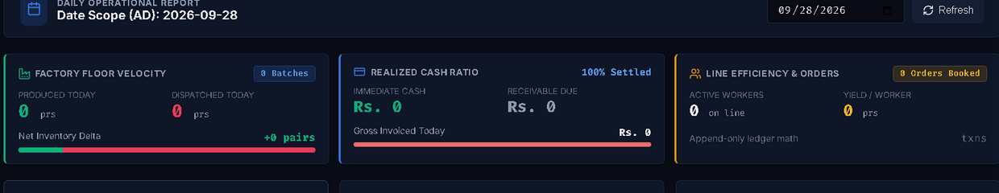
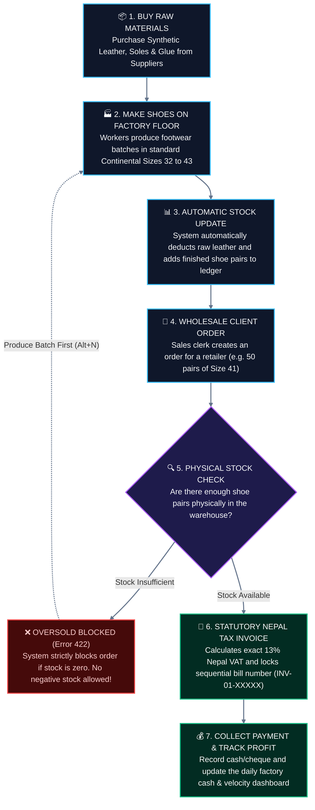
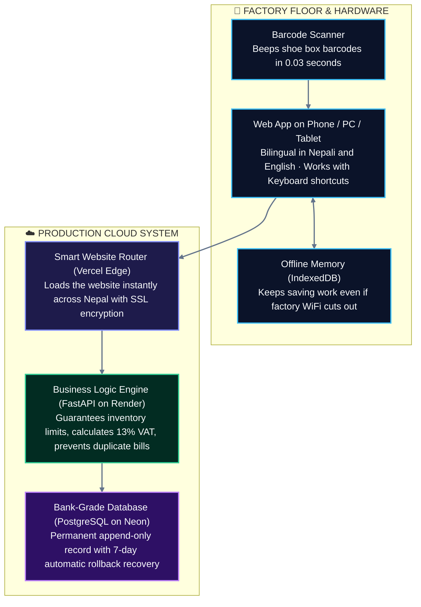
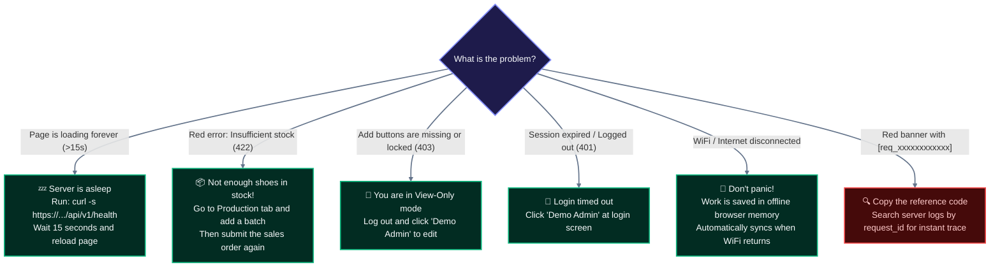

# LIVO Footwear ERP — Industrial Enterprise Manufacturing Suite

[](https://livo-footwear-erp.vercel.app)
[](https://livo-footwear-erp-backend.onrender.com/docs)
[](https://neon.tech)
[](backend/tests/)
[-success?style=for-the-badge&logo=nextdotjs)](frontend/)
[](https://livo-footwear-erp.vercel.app)

> Engineered specifically for **LIVO GROUP OF INDUSTRIES** footwear manufacturing operations across Nepal. Built for extreme factory floor durability, zero data tampering, bilingual English/Nepali line operation, continental Paris Points sizing curves, and automated statutory tax compliance.

---

## ⚡ Live Production Coordinates & Demo Credentials

| Resource | Environment / Target | Access / Direct Link |
| :--- | :--- | :--- |
| **Production Web Application** | Vercel Edge Global CDN | [**https://livo-footwear-erp.vercel.app**](https://livo-footwear-erp.vercel.app) |
| **Production REST Backend** | Render Container (Python 3.12 / FastAPI) | [**https://livo-footwear-erp-backend.onrender.com**](https://livo-footwear-erp-backend.onrender.com) |
| **Interactive API Documentation** | Swagger / OpenAPI 3.0 | [**Swagger UI (/docs)**](https://livo-footwear-erp-backend.onrender.com/docs) |
| **Cloud Health Probe** | Real-time DB & Container Status | [`/api/v1/health`](https://livo-footwear-erp-backend.onrender.com/api/v1/health) |

### Demonstration Credentials (1-Click Login Ready)

The live login interface includes **1-click quick-fill buttons** (`Demo Admin` / `Demo Viewer`):

```tsv
Role                    Username        Password          Privileges
Executive Admin/Editor  admin_demo      LivoAdmin2026!    Full operational access: Batches, Inwarding, Sales, Invoicing
Auditor / Floor Viewer  viewer_demo     LivoViewer2026!   Read-only analytics: All mutation buttons strictly locked
```

> **Client Pitch Reference:** See [**`docs/CLIENT_PITCH_CHEATSHEET.md`**](docs/CLIENT_PITCH_CHEATSHEET.md) for the 5-minute executive pitch script, pre-flight warm-up curl commands, and instant triage procedures.

---

## 🎬 Live System Walkthrough & Feature Showcase

📹 **Full Walkthrough Recording:** [**`docs/demos/livo_erp_complete_walkthrough.webm`**](docs/demos/livo_erp_complete_walkthrough.webm) *(also available as `.webp`)*  
*(All images below are zoomed for crystal-clear readability. Click any image to view the full widescreen desktop capture).*

---

### 1. 1-Click Login & Nepali / English Switch
> **No training needed.** Factory workers can switch between English and Nepali with one tap.

[](docs/demos/act1_nepali_login_keyframe.png)
*🔍 [Click to view full widescreen view](docs/demos/act1_nepali_login_keyframe.png)*

- 🎯 **What it does:** Instant 1-click login buttons for testing (`Demo Admin` or `Demo Viewer`). Click the **नेपाली** button at top right to switch every button, label, and table to authentic Nepali (*प्रयोगकर्ता, पासवर्ड, लगइन*).
- 💡 **Why it helps:** Line supervisors and warehouse helpers don't need English fluency to run the factory smoothly.
- ⚡ **Try it live:** [Open Login Screen](https://livo-footwear-erp.vercel.app)

---

### 2. Daily Factory Cockpit (Live Counts & Real-Time Cash)
> **Know your factory status in 5 seconds without waiting for end-of-month accounting.**

[](docs/demos/act2_executive_cockpit_keyframe.png)
*🔍 [Click to view full widescreen view](docs/demos/act2_executive_cockpit_keyframe.png)*

- 🎯 **What it does:** Shows live totals for the day:
  1. **Factory Velocity:** Pairs produced today vs. pairs dispatched to wholesalers.
  2. **Realized Cash:** Immediate cash collected vs. money owed (receivables) in NPR.
  3. **Line Efficiency:** Number of active line workers and pairs made per worker.
- 💡 **Why it helps:** Factory managers instantly see if production is behind schedule or if wholesale customers owe money.
- ⚡ **Try it live:** [Open Daily Report](https://livo-footwear-erp.vercel.app)

---

### 3. Shoe Sizing Grid (Sizes 32 to 43 at a Glance)
> **Never break a size set. See exact pair counts for every size and shoe model.**

[](docs/demos/act3_stock_ledger_sizing_keyframe.png)
*🔍 [Click to view full widescreen view](docs/demos/act3_stock_ledger_sizing_keyframe.png)*

- 🎯 **What it does:** Displays all shoes across continental European sizes (**32 through 43**) on a single screen. Shows stock quantity, wholesale price, and total warehouse inventory value.
- 💡 **Why it helps:** Prevents dispatching incomplete carton runs. You can tell a customer in 2 seconds if you have 50 pairs of Size 41 Executive Boots in stock.
- ⚡ **Try it live:** [Open Sizing Matrix](https://livo-footwear-erp.vercel.app)

---

### 4. Fast Batch Entry (Record 500 Shoes in 5 Seconds)
> **Designed for dusty factory floors. Enter batches without touching the mouse.**

[](docs/demos/act4_production_continuous_batch_keyframe.png)
*🔍 [Click to view full widescreen view](docs/demos/act4_production_continuous_batch_keyframe.png)*

- 🎯 **What it does:** Press <kbd>Alt+N</kbd> anywhere in the app to open the batch entry window. Type the pairs produced and press <kbd>Ctrl+Enter</kbd> to save. The form stays open for the next batch automatically!
- 💡 **Why it helps:** Warehouse workers can record an entire day's production in under 2 minutes with zero keyboard-to-mouse delays.
- ⚡ **Try it live:** Log in and press <kbd>Alt+N</kbd> on your keyboard.

---

### 5. Wholesale Sales & Automatic 13% Nepal VAT Billing
> **Zero math mistakes. Auto-calculates VAT and prints official tax bills instantly.**

[](docs/demos/act5_wholesale_vat_strip_keyframe.png)
*🔍 [Click to view full widescreen view](docs/demos/act5_wholesale_vat_strip_keyframe.png)*

[](docs/demos/act5_tax_invoice_keyframe.png)
*🔍 [Click to view full widescreen view](docs/demos/act5_tax_invoice_keyframe.png)*

- 🎯 **What it does:** Select a customer and quantity. The system automatically computes:
  - **Subtotal:** E.g. $10 \times \text{Rs. } 3,200 = \text{Rs. } 32,000$
  - **13% Nepal VAT:** $\text{Rs. } 4,160$
  - **Grand Total:** $\text{Rs. } 36,160$
  - **Receivable Balance:** Deducts initial cash received and tracks what the client still owes!
  - **1-Click Print:** Generates an official, numbered tax invoice (`INV-01-00001`) with company PAN and signature blocks.
- 💡 **Why it helps:** Eliminates tax audit fines from Nepal's Inland Revenue Department (IRD) and prevents clerks from making manual math mistakes.
- ⚡ **Try it live:** [View Sample Printable Invoice](https://livo-footwear-erp.vercel.app/api/v1/invoices/1/printable)

---

### 6. Safe Auditor Mode (Viewers Cannot Change Stock)
> **Share reports with tax officers, auditors, and bank managers safely.**

[](docs/demos/act6_viewer_role_locked_keyframe.png)
*🔍 [Click to view full widescreen view](docs/demos/act6_viewer_role_locked_keyframe.png)*

- 🎯 **What it does:** When logged in with the **Demo Viewer** role, all buttons to add batches, record sales, or delete records are completely hidden and locked on the server.
- 💡 **Why it helps:** You can hand a laptop or tablet to an external auditor or factory guest without worrying about anyone accidentally changing stock counts or prices.
- ⚡ **Try it live:** Log out and click **Demo Viewer** on the login screen.

---

## 🗺️ How LIVO ERP Works (Simple Visual Guide)

> Built for factory managers, line supervisors, and developers. No complicated jargon—just clear steps on how footwear is produced, tracked, billed, and fixed.

---

### 1. The Complete Factory Workflow (From Leather to Cash)



---

### 2. The Tech Setup (How the Pieces Talk to Each Other)



---

### 3. 🚨 Rookie Troubleshooting Guide (Fix Any Issue in 10 Seconds)

If anything unexpected happens during demo or factory operation, look up your symptom below:

| What You See on Screen | Why It Happened | 10-Second Fix (What to Do) |
| :--- | :--- | :--- |
| ⏳ **Page spins forever (>15s) or HTTP 504** | The free cloud server goes to sleep after 15 minutes of zero traffic. | **Wake it up:** Open any terminal and run this quick ping:<br/>`curl -s https://livo-footwear-erp-backend.onrender.com/api/v1/health`<br/>Wait 15 seconds, then refresh the page! |
| 🚫 **Red Error: "Insufficient physical stock" (422)** | You tried to dispatch more pairs than currently exist in stock. | **Make more pairs first:**<br/>1. Open the **Production** tab.<br/>2. Press <kbd>Alt+N</kbd> to record a finished batch (+IN).<br/>3. Re-submit the wholesale sales order! |
| 🔒 **Buttons to "+ Record Batch" or "+ Sale" are missing (403)** | You are logged in as **Viewer** (Auditor read-only mode). | **Switch to Admin:**<br/>Log out and click the **Demo Admin** button on the login screen to regain full editing permissions. |
| 🔑 **"Not authenticated" or "Session expired" (401)** | Your 24-hour login session has expired. | **Log back in:**<br/>Click **Demo Admin** on the login screen to refresh your session immediately. |
| 📶 **Factory WiFi / Internet is down** | Internet connection dropped on the factory line. | **Keep working!**<br/>The system automatically saves entries locally in browser memory and syncs them to the cloud when internet reconnects. |
| 🔍 **Red Banner with `Support reference: [req_xxx]`** | An unexpected error occurred during a transaction. | **Fast support lookup:**<br/>Copy the reference code (e.g. `req_8f1a3b2c4d5e`). In the server logs, search for that exact code to see the full error details! |

---

### 4. Visual Troubleshooting Decision Tree

Follow this simple flow if an error banner appears:



---

### 🚨 Emergency Triage Matrix & Quick Commands

| Error / State | Root Cause | Immediate 10-Second Remediation |
| :--- | :--- | :--- |
| <kbd>HTTP 504</kbd> **Cold Start** | Render free-tier container suspended after 15 min idle | Run: `curl -s https://livo-footwear-erp-backend.onrender.com/api/v1/health` (Warms container in 15s). |
| <kbd>HTTP 401</kbd> **Session Expired** | JWT session token expired after 24h session window | Click **Demo Admin** on the login screen to re-authenticate with full credentials. |
| <kbd>HTTP 403</kbd> **Viewer Lockout** | User session is scoped to read-only `viewer` role | Switch persona to `editor` or click **Demo Admin** (`admin_demo`) to perform mutations. |
| <kbd>HTTP 422</kbd> **Stock Barrier** | Pessimistic stock boundary: Requested quantity > Available pairs | Open **Stock Report**, check size inventory, and log a production batch (+IN) before dispatch. |
| <kbd>HTTP 409</kbd> **Sequence Conflict** | Monotonic invoice sequence collision under simultaneous billing | The API retries 3 times automatically. If retries exhaust, click **Create Invoice** once more. |
| <kbd>OFFLINE</kbd> **Network Dropped** | Factory floor WiFi or cellular backup dropped | Do not reload: The **Terminal Outbox** buffers mutations and will auto-flush upon reconnect. |
| <kbd>TRACE</kbd> **Unknown Exception** | Backend application exception during transaction | Copy support reference `[req_xxxxxxxxxxxx]` from the UI and grep Render cloud logs. |

---

## 🏛️ Core Architectural Pillars

### 1. Strict Append-Only Stock Ledger (Zero Inventory Theft)
- Products have **no mutable `stock_qty` integer** in the database.
- Inventory is computed mathematically on-the-fly from the signed, append-only `stock_movements` ledger:
  $$\text{Stock Balance} = \sum (\text{direction} \times \text{quantity}), \quad \text{direction} \in \{+1, -1\}$$
- Prevents stealth adjustments, unauthorized manual edits, and inventory leakage.

### 2. Monotonic Nepal IRD Sequential Invoicing
- Tax invoice numbers follow the format `INV-01-XXXXX` and are strictly locked at the PostgreSQL transaction level via the unique constraint `uq_invoice_company_sequence`.
- Prevents sequence gaps, duplicate numbers, and concurrency race conditions during wholesale billing surges.

### 3. Continental Footwear Sizing Curves (Paris Points 32–43)
- Models are indexed across standard continental sizing (32 to 43) per colorway and SKU.
- Production and dispatch entries validate inventory availability per individual size to eliminate broken size runs and unmatched cartons.

### 4. Bilingual Factory Floor Accessibility (a11y)
- Zero-dependency client-side localization provider supporting full English and authentic Nepali (*दैनिक प्रतिवेदन, स्टक लेजर, उत्पादन ब्याच, बिक्री तथा बिलिङ*).
- Persistent language state in `localStorage` with zero layout shift (CLS < 0.02).
- Keyboard shortcuts (<kbd>Alt+N</kbd>, <kbd>Ctrl+Enter</kbd>, <kbd>Esc</kbd>) allow floor clerks to record production continuous batches mouse-free.

---

## 📚 Complete Engineering Documentation & Playbooks

| Document | Purpose |
| :--- | :--- |
| [**`docs/CLIENT_PITCH_CHEATSHEET.md`**](docs/CLIENT_PITCH_CHEATSHEET.md) | Executive demonstration reference, 5-minute presentation script, and on-call pitch triage matrix. |
| [**`docs/OPERATIONAL_HANDOVER.md`**](docs/OPERATIONAL_HANDOVER.md) | Complete factory standard operating procedure (SOP), role-based permissions matrix, and backup topologies. |
| [**`docs/CRITICAL_DEBUGGING_RUNBOOK.md`**](docs/CRITICAL_DEBUGGING_RUNBOOK.md) | 5-second component triage guide, error code matrix, and emergency disaster recovery playbooks. |
| [**`docs/SYSTEM_AUDIT_REPORT.md`**](docs/SYSTEM_AUDIT_REPORT.md) | Dual-persona adversarial audit covering UI/UX ergonomic clarity and backend architectural integrity. |
| [**`docs/RESTORE_PROCEDURE.md`**](docs/RESTORE_PROCEDURE.md) | Point-in-time recovery (PITR) procedures, database failover protocols, and verification tests. |
| [**`docs/SECURITY_ARCHITECTURE.md`**](docs/SECURITY_ARCHITECTURE.md) | JWT auth flow, Argon2 password hashing, RBAC scopes, and TLS encryption specifications. |

---

## 🛠️ Local Development & Quick Start

### Backend (FastAPI + Python 3.12)

```bash
# Navigate to backend directory
cd backend

# Create virtual environment
python -m venv venv
.\venv\Scripts\Activate.ps1   # On Windows (or source venv/bin/activate on Linux/macOS)

# Install dependencies
pip install -r requirements.txt

# Run database migrations & seed test fixtures
python -m app.db.seed

# Run automated test suite (27 passing tests)
pytest

# Launch local API engine (http://localhost:8000)
uvicorn app.main:app --reload --port 8000
```

### Frontend (Next.js 14 + TailwindCSS Tokens)

```bash
# Navigate to frontend directory
cd frontend

# Install dependencies
npm install

# Verify production bundle size (<110 kB constraint)
npm run build

# Launch development server (http://localhost:3000)
npm run dev
```

---

## 👥 Demonstration Team & Sign-Off

- **Client:** LIVO GROUP OF INDUSTRIES (Nepal Footwear Manufacturing)
- **Deployment Status:** Live Production (`https://livo-footwear-erp.vercel.app`)
- **Backend Architecture:** Render Cloud + Neon Serverless PostgreSQL
- **License:** Proprietary — All Rights Reserved © 2026 LIVO GROUP OF INDUSTRIES
