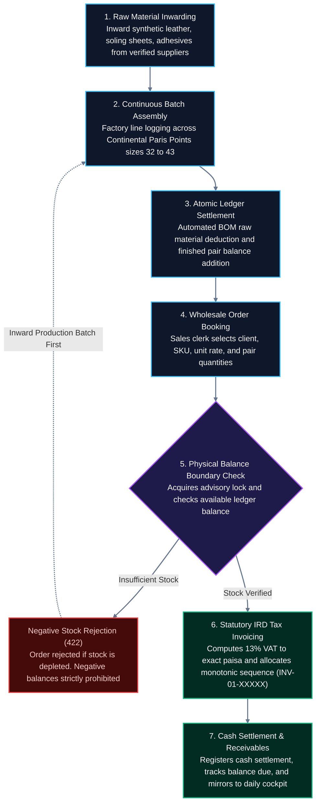
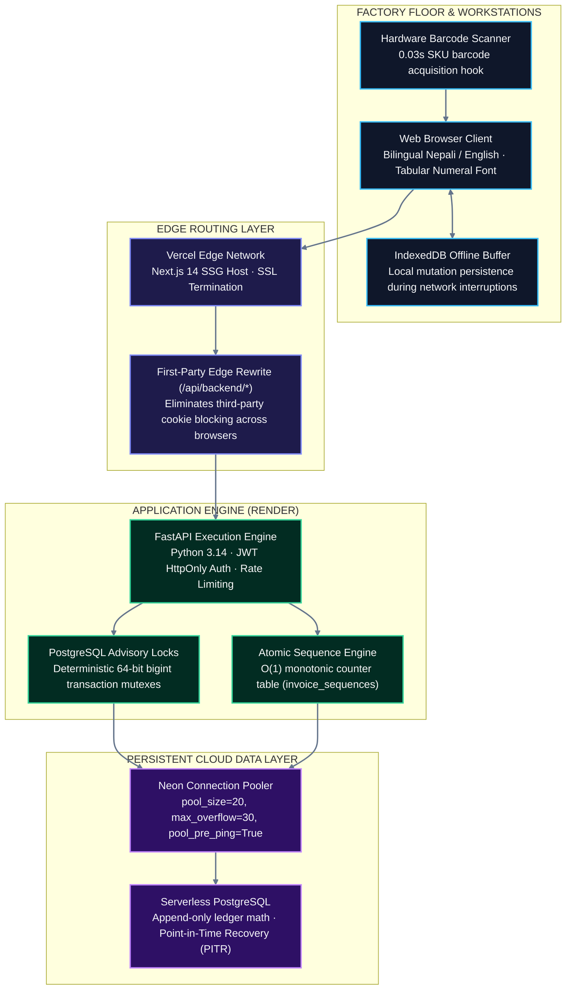
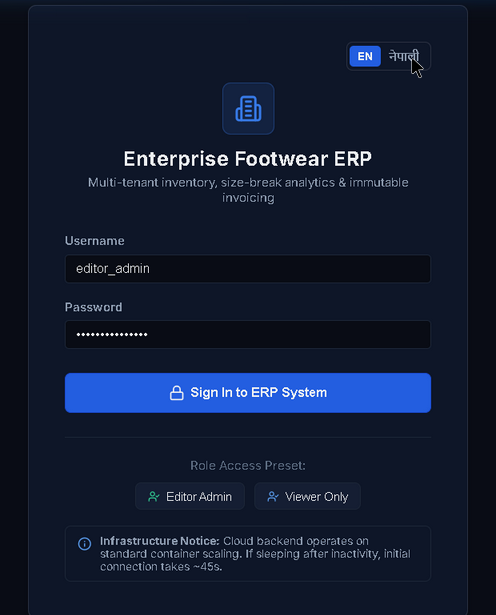
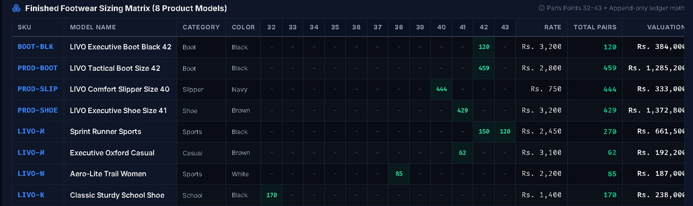
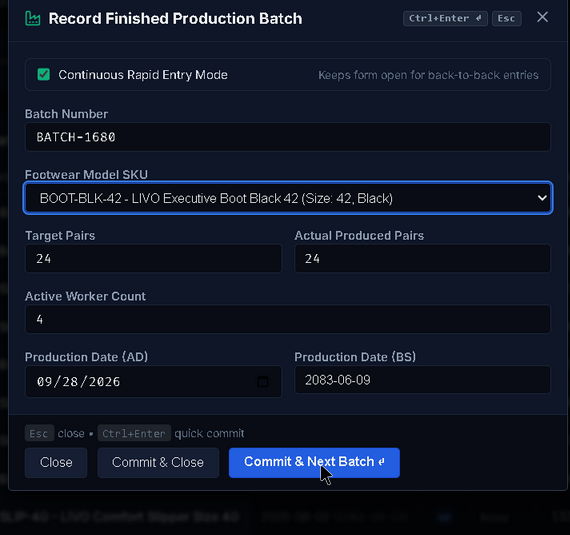
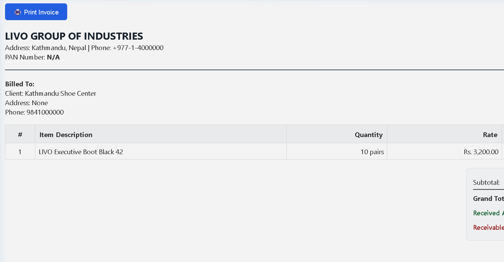
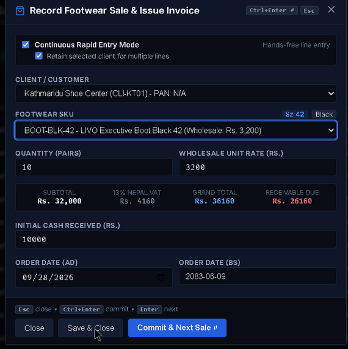
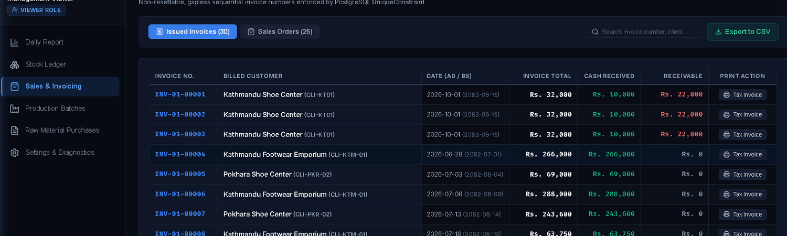

# LIVO Footwear ERP — Industrial Manufacturing Suite

[](https://livo-footwear-erp.vercel.app)
[](https://livo-footwear-erp-backend.onrender.com/docs)
[](https://neon.tech)
[](backend/tests/)
[-success?style=for-the-badge&logo=nextdotjs)](frontend/)
[](https://livo-footwear-erp.vercel.app)

> Purpose-built footwear enterprise operating system for Nepal's manufacturing hubs, engineered for high-concurrency dispatch, factory-floor ergonomics, and statutory tax compliance.

---

## 1. System Coordinates & Demo Credentials

### Production Endpoints

| Resource | Environment / Target | Access / Direct Link |
| :--- | :--- | :--- |
| **Production Web Application** | Vercel Global Edge Network | [**https://livo-footwear-erp.vercel.app**](https://livo-footwear-erp.vercel.app) |
| **Production REST Backend** | Render Container (Python 3.14 / FastAPI) | [**https://livo-footwear-erp-backend.onrender.com**](https://livo-footwear-erp-backend.onrender.com) |
| **Interactive API Documentation** | OpenAPI 3.0 / Swagger UI | [**Swagger UI (/docs)**](https://livo-footwear-erp-backend.onrender.com/docs) |
| **Cloud Health Probe** | Real-time Database & Container Probe | [`/api/v1/health`](https://livo-footwear-erp-backend.onrender.com/api/v1/health) |

### Demonstration Credentials (1-Click Login Enabled)

The production web interface includes dedicated persona quick-fill buttons for operational and auditing workflows:

| Role | Username | Password | Operational Scope |
| :--- | :--- | :--- | :--- |
| **Executive Admin / Operator** | `admin_demo` | `LivoAdmin2026!` | Full write permissions: Inwarding, Batch Assembly, Sales Dispatch, Tax Invoicing, Backups |
| **Statutory Auditor (Read-Only)** | `viewer_demo` | `LivoViewer2026!` | Read-only verification: Mutation endpoints and buttons are blocked and hidden |

---

## 2. Technical Architecture & Data Flow

### Factory Operational Lifecycle



### System Topology & Edge Proxy Wiring



---

## 3. Manufacturing System Scope & 9-Module Operational Matrix

LIVO Footwear ERP is an industrial manufacturing suite purpose-engineered for high-velocity shoe manufacturing plants in Nepal, ensuring strict Inland Revenue Department (IRD) statutory compliance, zero-inventory-leakage ledger accounting, and ergonomic shop-floor operation under plant lighting conditions.

| # | Operational Module | Scope & Architecture Invariants | Key Ergonomics & Protocols |
|---|:---|:---|:---|
| **1** | **Production Batch Terminal** | Rapid shop-floor production logging across Continental Paris Points sizes 32 to 43. Atomic BOM consumption and finished goods addition. | "No-mouse" keyboard navigation (<kbd>Tab</kbd> / <kbd>Enter</kbd> / <kbd>Ctrl+Enter</kbd>), auto-incrementing batch sequences, and local IndexedDB offline sync. |
| **2** | **Stock Movement Ledger & Sizing Matrix** | Strict append-only signed inventory subledger ($\sum \text{direction} \times \text{qty}$). Zero mutable stock columns; zero-floor protection against overselling. | Horizontal Paris Points grid (32–43) with sticky left SKU headers, real-time Stock Card modals, and supervisor-token authorization for adjustments. |
| **3** | **Statutory Sales Invoicing** | Inland Revenue Department (IRD) Schedule-5 VAT invoice generation. Integer-paisa tax arithmetic, monotonic invoice sequences (`INV-01-XXXXX`). | Dual-unit packaging calculator (`1 Carton = 12 Pairs`), A4 `@media print` layout with buyer/seller PAN blocks, and duplicate invoice rejection. |
| **4** | **Accounts Receivable & Aging** | Append-only AR debtor subledger tracking invoices, cash/bank receipts, and disputes. Dynamic as-of aging buckets: Current, 31–60d, 61–90d, >90d. | Customer credit-hold dispatch lock, real-time party account statements, and dispute flag isolation without altering statutory tax obligations. |
| **5** | **HR Management & Worker Payroll (Point 4)** | Multi-tenant staff directory supporting 50+ workers across two shifts. Distinguishes Monthly Salaried personnel and Daily/Hourly Wage staff. | Real-time Advance (पेश्की) ledger ($\sum \text{Issued} - \sum \text{Recovered}$), automatic advance deduction upon payroll finalization, TWH and $1.5\times$ Overtime logging, and Active/Inactive status toggle. |
| **6** | **Product Media Gallery (Point 5)** | High-resolution SKU-linked product image library for marketing and wholesale line sheets. Base64/cloud asset storage with size capping ($\le 5\text{MB}$). | Lightbox full-screen preview, one-click binary file download for local galleries and dealer WhatsApp sharing, and read-only auditor lockdown. |
| **7** | **Production Trends & Ratio Analytics (Points 6 & 9)** | Production intelligence dashboard correlating daily finished pairs against workforce labor inputs (worker count and total shift hours). | Interactive dual-axis SVG graph (Finished Pairs bars vs. Pairs/Worker ratio line), selectable time horizons (`1 Month`, `3 Months`, `1 Year`), and shift log audits. |
| **8** | **Sales & Customer Leaderboards (Points 7 & 8)** | Commercial performance intelligence ranking top products and wholesale clients. | Top-selling footwear models ranked on top with Gold (#1), Silver (#2), and Bronze (#3) podium badges; Top Customers ranked serially highest to lowest with pair totals, revenue, and reliability scoring. |
| **9** | **Supervisor Exception Cockpit & Telemetry** | Centralized manufacturing oversight and diagnostic center. Live monitors stockouts, credit-holds, broken core curves (sizes 39–41), and offline sync queues. | Real-time `X-Correlation-ID` request tracking, automated database backup integrity drills, and instant single-click seed/diagnostic telemetry. |

---

## 4. Key Technical Metrics & Compliance Profile

| Parameter | Production Specification | Architectural Rationale |
|:---|:---|:---|
| **Database Migrations** | **9 Linear Alembic Revisions** (`001_initial` &rarr; `009_gallery_and_analytics`) | Zero schema drifts; reversible, reproducible database lineage across cloud instances. |
| **Automated Test Suite** | **64/64 Tests Passing (100%)** (`pytest backend/tests/ -v`) | Comprehensive test coverage across security, multi-tenant isolation, inventory locks, VAT math, HR payroll, and analytics. |
| **Frontend Bundle Budget** | **109 kB First Load JS** (`next build`) | Strictly within factory edge performance budget (<115 kB) for instantaneous loading on 3G cellular and plant Wi-Fi. |
| **Visual Design System** | **Industrial Paper Palette** (`#F8FAFC` base, `#CBD5E1` borders, `#0F172A` ink) | Eliminates ocular glare under 500-lux factory fluorescent lamps; strictly uses tabular numerals (`font-mono`) for zero alignment drift. |
| **Statutory Compliance** | **Nepal Inland Revenue Department (IRD)** Schedule-5 VAT Compliant | Exact integer-paisa tax calculation, 9-digit PAN validation, gapless monotonic numbering, and immutable audit trails. |
| **Concurrency Safeguards** | **64-bit PostgreSQL Advisory Locks** (`pg_advisory_xact_lock`) | Transaction-scoped row-level mutexes eliminate race conditions during concurrent wholesale dispatch checkout surges. |

---

## 5. Core Operational Capabilities (Visual Showcase)

### 1. Industrial Paper High-Contrast Canvas
High-contrast neutral theme (`#F8FAFC` base, `#FFFFFF` surfaces, `#0F172A` primary text) designed to eliminate screen reflection glare under 500-lux factory fluorescent lamps while saving operator ocular fatigue.

[](docs/demos/act1_nepali_login_keyframe.png)  
*Full-resolution preview:* [Open desktop capture](docs/demos/act1_nepali_login_keyframe.png)

- **Factory Usability:** Instant persona fills (`Demo Admin` / `Demo Viewer`). One-click vernacular switcher toggles entire application between English and native Nepali (*प्रयोगकर्ता*, *पासवर्ड*, *लगइन*).
- **Verification:** [Open Live Login](https://livo-footwear-erp.vercel.app)

### 2. Continental Sizing Matrix (Sizes 32–43)
Horizontal matrix grid tailored for footwear distribution across continental sizes 32 through 43 with spreadsheet-grade row density (strictly 36px row height).

[](docs/demos/act3_stock_ledger_sizing_keyframe.png)  
*Full-resolution preview:* [Open desktop capture](docs/demos/act3_stock_ledger_sizing_keyframe.png)

- **Fixed Identification:** Sticky left-pinned columns for SKU and Article Name maintain model visibility while scrolling horizontally on 768px/1024px tablet screens.
- **Broken Run Alerting:** Zero stock rendered as clean dashes (`-`); incomplete size runs across active footwear lines are highlighted with a distinct warning border.
- **Verification:** [Open Live Stock Report](https://livo-footwear-erp.vercel.app)

### 3. Continuous Keyboard Batch Entry
Docked entry panel built for high-velocity factory line data entry without touching a mouse.

[](docs/demos/act4_production_continuous_batch_keyframe.png)  
*Full-resolution preview:* [Open desktop capture](docs/demos/act4_production_continuous_batch_keyframe.png)

- **Ergonomics:** Pressing <kbd>Alt+N</kbd> summons the batch dock. Operators cycle sequentially across sizes 32–43 using <kbd>Tab</kbd> or <kbd>Enter</kbd>.
- **Rapid Cycle:** <kbd>Ctrl+Enter</kbd> commits the batch to the ledger, auto-increments the batch sequence number, clears entry values, and refocuses size 32.

### 4. Statutory Nepal IRD Tax Invoice (कर बिजक)
Standardized Schedule-5 tax invoice format complying with Nepal Inland Revenue Department (IRD) specifications.

[](docs/demos/act5_tax_invoice_keyframe.png)  
*Full-resolution preview:* [Open desktop capture](docs/demos/act5_tax_invoice_keyframe.png)

- **Institutional Breakdown:** Prominently displays Company PAN (`609823412`) and Buyer PAN in segmented digit boxes.
- **Paisa-Level Precision:** Enforces exact two-decimal monospace calculations: $\text{Taxable Subtotal} \to \text{13\% Nepal VAT} \to \text{Grand Total NPR}$.
- **Verification:** [View Printable Tax Invoice Sample](https://livo-footwear-erp.vercel.app)

### 5. Dual-Unit Packaging Calculator
Wholesale dispatch module preventing carton-versus-pair under-dispatch errors.

[](docs/demos/act5_wholesale_vat_strip_keyframe.png)  
*Full-resolution preview:* [Open desktop capture](docs/demos/act5_wholesale_vat_strip_keyframe.png)

- **Dual-Unit Converter:** Prominently renders the statutory conversion factor: `"१ कार्टुन = १२ जोर (1 Carton = 12 Pairs)"`.
- **Live Carton Arithmetic:** Live calculator automatically computes and displays carton quantities as line items are keyed in (e.g., $48\text{ pairs} \to 4.0\text{ Cartons}$).

### 6. Read-Only Auditor Lockdown Mode
Role-based immutable view ensuring external tax auditors, revenue inspectors, and lenders cannot alter operational records.

[](docs/demos/act6_viewer_role_locked_keyframe.png)  
*Full-resolution preview:* [Open desktop capture](docs/demos/act6_viewer_role_locked_keyframe.png)

- **Defense-in-Depth:** Under `viewer_demo`, mutating UI buttons (`+ Record Batch`, `+ Record Sale`, `Void`) are stripped from the DOM.
- **Backend Rejection:** All POST/PUT/DELETE attempts receive immediate `HTTP 403 Forbidden` responses enforced by role dependencies.

---

## 6. Architectural Invariants & Production Hardening

### 1. Strict Append-Only Stock Ledger (Zero Inventory Leakage)
- The database schema contains **no mutable `stock_qty` column** on product tables.
- Inventory balances are derived on-the-fly from signed ledger transactions:
  $$\text{Current Available Stock} = \sum (\text{direction} \times \text{quantity}), \quad \text{direction} \in \{+1, -1\}$$
- Ledger Snapshot Materialization: Periodic snapshot records (`stock_snapshots`) materialize running balances at discrete checkpoints, enabling $O(1)$ balance verification across millions of historic transactions.

### 2. Distributed Concurrency Control (PostgreSQL Advisory Locks)
- In-process locks (`threading.Lock`) are deprecated to eliminate blindspots across multi-worker Uvicorn instances and container replicas.
- Deterministic 64-bit bigint transaction advisory locks are acquired before balance evaluations:
  $$\text{lock\_key} = ((\text{company\_id} \ \& \ \text{0xFFFFFFFF}) \ll 32) \mid (\text{product\_id} \ \& \ \text{0xFFFFFFFF})$$
- Executed via `SELECT pg_advisory_xact_lock(:lock_id)` inside transaction boundaries, with automatic lock release upon `COMMIT` or `ROLLBACK`. Multiple items in a sales dispatch are acquired in sorted `product_id` sequence to prevent AB-BA deadlocks.

### 3. Atomic Monotonic Sequence Allocation ($O(1)$)
- Eliminated optimistic sequence collision storms (`SELECT MAX(sequence) + 1` retry loops) by introducing the `invoice_sequences` table.
- Monotonic numbers are allocated using pessimistic row locks:
  ```sql
  SELECT current_sequence FROM invoice_sequences WHERE company_id = :company_id FOR UPDATE;
  ```
- Increments sequence by 1 and commits in $O(1)$ execution time, ensuring gapless monotonicity (`INV-01-00001`, `INV-01-00002`) without throwing `HTTP 409 Conflict` during simultaneous checkout surges.

### 4. Defensive Security & Statutory Invariants
- **Stored XSS Neutralization:** All dynamic values rendered in printable HTML tax invoices (`company.name`, `client.name`, `product.name`, `invoice_number`, addresses) pass through `html.escape()` before template interpolation.
- **Duplicate Tax Liability Barrier:** Rejects duplicate active VAT invoices against an already invoiced sales order with `HTTP 409 Conflict`, guaranteeing Schedule-5 compliance.
- **Reverse Proxy Cookie Eviction:** Cookie revocation in `/api/v1/auth/logout` sets explicit matching attributes (`path="/"`, `httponly=True`, `samesite="lax"`, `secure=True`, `max_age=0, expires=0`) to ensure browser cache eviction across Nginx, Cloudflare, Traefik, and AWS ALB proxies.

---

## 7. Operational Triage & Engineering Documentation

### Single 10-Second Operational Triage Reference

| Observed Condition | Root Cause Diagnosis | Immediate Action Protocol |
| :--- | :--- | :--- |
| **HTTP 504 or Spinning >15s** | Render free-tier backend container spun down after 15 min idle | **Warm container:** Execute `curl -s https://livo-footwear-erp-backend.onrender.com/api/v1/health`; reload browser after 15s. |
| **HTTP 422: "Insufficient physical stock"** | Dispatch quantity exceeds available ledger balance for SKU | **Inward batch first:** Open Production tab, press <kbd>Alt+N</kbd>, record finished batch (+IN), then re-dispatch order. |
| **HTTP 403: Mutation Controls Missing** | Current session authenticated under read-only `viewer` role | **Switch role:** Log out and click **Demo Admin** on the login canvas to regain full write privileges. |
| **HTTP 401: "Session Expired"** | JWT cookie exceeded 24-hour expiration window | **Re-authenticate:** Click **Demo Admin** on the login screen to receive a fresh signed JWT token. |
| **Factory WiFi Dropped (Offline State)** | Physical floor network disconnection | **Continue line entry:** The IndexedDB outbox buffers local transactions and synchronizes automatically upon reconnect. |
| **Support Banner with `[req_xxxxxxxxxxxx]`** | Unhandled exception during transactional commit | **Isolate log trace:** Copy the 12-character hexadecimal correlation ID and search server telemetry logs. |

### Engineering Documentation Index

| Operational Document | Scope & Specification |
| :--- | :--- |
| [`docs/OPERATIONAL_HANDOVER.md`](docs/OPERATIONAL_HANDOVER.md) | Factory standard operating procedures, operator role matrix, and backup topologies. |
| [`docs/LIVO_ERP_Visual_Operations_Manual_and_Playbook.md`](docs/LIVO_ERP_Visual_Operations_Manual_and_Playbook.md) | Comprehensive 13-chapter visual operations manual, DOM screenshots, callouts, and SOPs. |
| [`docs/SECURITY_ARCHITECTURE.md`](docs/SECURITY_ARCHITECTURE.md) | JWT specifications, Argon2 password hashing, RBAC scopes, and TLS encryption. |
| [`docs/RESTORE_PROCEDURE.md`](docs/RESTORE_PROCEDURE.md) | Point-in-time recovery (PITR) protocols and database failover verification tests. |
| [`docs/CRITICAL_DEBUGGING_RUNBOOK.md`](docs/CRITICAL_DEBUGGING_RUNBOOK.md) | Component-by-component triage guide, recovery runbooks, and disaster recovery procedures. |
| [`docs/SYSTEM_AUDIT_REPORT.md`](docs/SYSTEM_AUDIT_REPORT.md) | Architectural audit verifying multi-tenant boundary checks and ledger invariants. |
| [`docs/CLIENT_PITCH_CHEATSHEET.md`](docs/CLIENT_PITCH_CHEATSHEET.md) | Executive pitch scripts, pre-flight warmup procedures, and on-call demo triage. |

---

## 8. Local Setup & Verification

<details>
<summary><b>Click to view Local Setup & Test Suite Commands</b></summary>

### Backend Setup (FastAPI + Python 3.14)

```bash
# Navigate to backend directory
cd backend

# Create and activate virtual environment
python -m venv venv
.\venv\Scripts\Activate.ps1   # On Windows (or 'source venv/bin/activate' on Linux/macOS)

# Install production and testing dependencies
pip install -r requirements.txt

# Run database migrations and seed demonstration data
alembic upgrade head
python -m app.db.seed

# Run the complete automated test suite (64 passing tests)
pytest -v

# Launch local backend server (http://localhost:8000)
uvicorn app.main:app --reload --port 8000
```

### Frontend Setup (Next.js 14 + TailwindCSS Tokens)

```bash
# Navigate to frontend directory
cd frontend

# Install dependencies
npm install

# Verify production bundle budget (<115 kB First Load JS budget, current: 109 kB)
npm run build

# Launch local development server (http://localhost:3000)
npm run dev
```

</details>

---

## Institutional Sign-Off

- **Enterprise:** LIVO GROUP OF INDUSTRIES (Footwear Manufacturing Division)
- **Deployment Status:** Live Production ([`livo-footwear-erp.vercel.app`](https://livo-footwear-erp.vercel.app))
- **Production Architecture:** 9-Module Industrial Footwear Suite (Migrations `001` through `009`)
- **Automated Verification:** 64/64 Passing Tests (`pytest 9.1.1`) • 109 kB First Load JS Bundle (<115 kB budget)
- **License:** Proprietary — All Rights Reserved © 2026 LIVO GROUP OF INDUSTRIES
