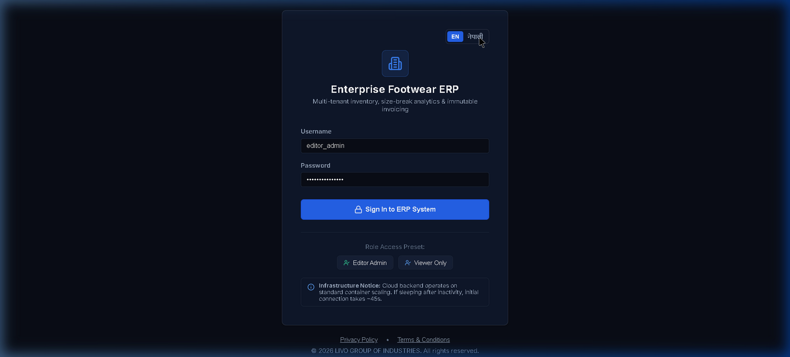
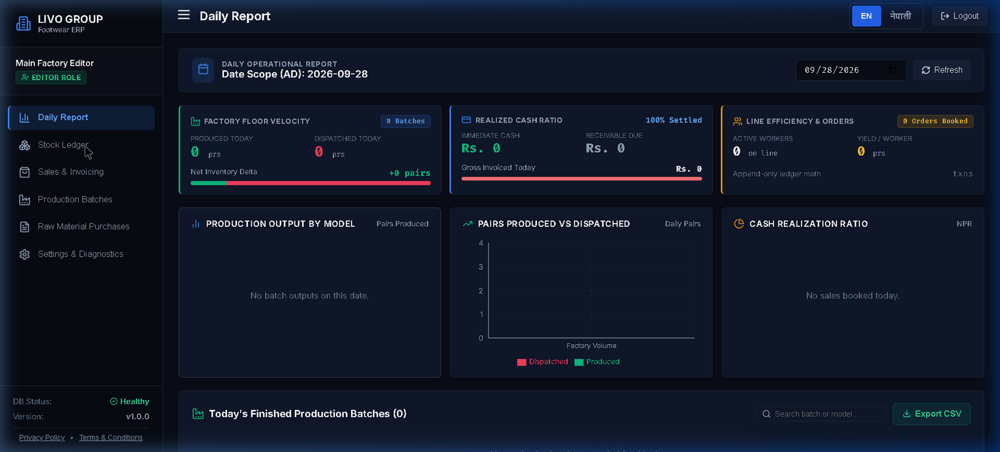
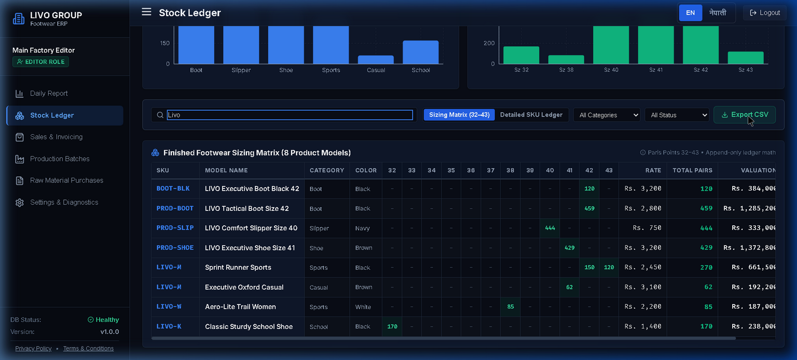
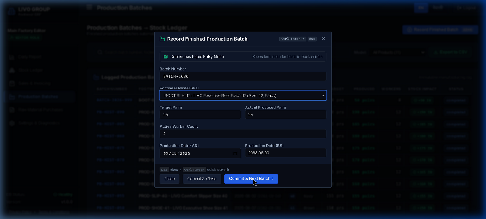
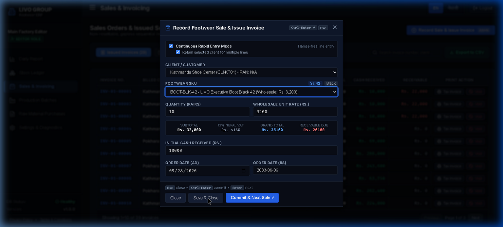
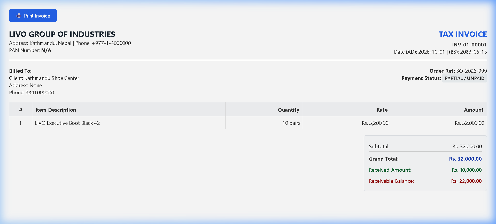
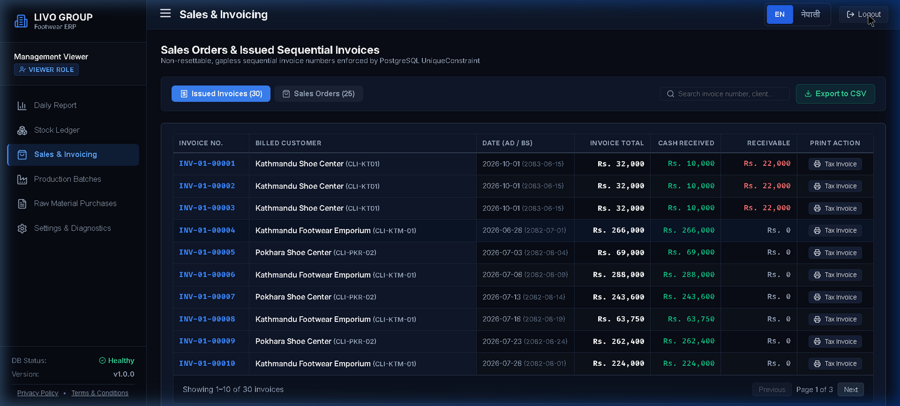

# LIVO Footwear ERP — Industrial Enterprise Manufacturing Suite

[](https://livo-footwear-erp.vercel.app)
[](https://livo-footwear-erp-backend.onrender.com/docs)
[](https://neon.tech)
[](backend/tests/)
[-success?style=for-the-badge&logo=nextdotjs)](frontend/)
[](https://livo-footwear-erp.vercel.app)

> Engineered specifically for **LIVO GROUP OF INDUSTRIES** footwear manufacturing operations across Nepal. Built for extreme factory floor durability, zero data tampering, bilingual English/Nepali line operation, continental Paris Points sizing curves, and automated statutory tax compliance.

---

## ⚡ Live Production Coordinates & Demo Credentials

| Resource | Environment / Target | Access / Direct Link |
| :--- | :--- | :--- |
| **Production Web Application** | Vercel Edge Global CDN | [**https://livo-footwear-erp.vercel.app**](https://livo-footwear-erp.vercel.app) |
| **Production REST Backend** | Render Container (Python 3.12 / FastAPI) | [**https://livo-footwear-erp-backend.onrender.com**](https://livo-footwear-erp-backend.onrender.com) |
| **Interactive API Documentation** | Swagger / OpenAPI 3.0 | [**Swagger UI (/docs)**](https://livo-footwear-erp-backend.onrender.com/docs) |
| **Cloud Health Probe** | Real-time DB & Container Status | [`/api/v1/health`](https://livo-footwear-erp-backend.onrender.com/api/v1/health) |

### Demonstration Credentials (1-Click Login Ready)

The live login interface includes **1-click quick-fill buttons** (`Demo Admin` / `Demo Viewer`):

```tsv
Role                    Username        Password          Privileges
Executive Admin/Editor  admin_demo      LivoAdmin2026!    Full operational access: Batches, Inwarding, Sales, Invoicing
Auditor / Floor Viewer  viewer_demo     LivoViewer2026!   Read-only analytics: All mutation buttons strictly locked
```

> **Client Pitch Reference:** See [**`docs/CLIENT_PITCH_CHEATSHEET.md`**](docs/CLIENT_PITCH_CHEATSHEET.md) for the 5-minute executive pitch script, pre-flight warm-up curl commands, and instant triage procedures.

---

## 🎬 Automated End-to-End Walkthrough (Acts 1–6)

Recorded live across the deployed cloud environment using the DOM/browser agent:

📹 **Full Walkthrough Video:** [**`docs/demos/livo_erp_complete_walkthrough.webm`**](docs/demos/livo_erp_complete_walkthrough.webm) *(also available as `.webp`)*

### Act 1: Login & Bilingual Factory Ergonomics
*Instant 1-click toggle between English and authentic Nepali (*प्रयोगकर्ता, पासवर्ड, लगइन*). Supports non-English-speaking factory supervisors.*



---

### Act 2: Daily Executive Cockpit & Production Velocity
*Factory Floor Velocity tracking (Produced vs. Dispatched ratio), Realized Cash Ratio, and line throughput without end-of-month lag.*



---

### Act 3: Finished Footwear Sizing Matrix (Paris Points 32–43)
*Continental sizing curves across standard footwear sizes (32–43) with green in-stock indicators, zero-stock dashes, sticky columns, and 1-click CSV export.*



---

### Act 4: Hands-Free Rapid Production Entry
*Keyboard-driven sequential entry (<kbd>Alt+N</kbd> drawer trigger, sequential field traversal, <kbd>Ctrl+Enter</kbd> commit) with auto-incrementing batch sequence (`BATCH-1680`).*



---

### Act 5: Wholesale Sales Order, Live 13% VAT Strip & Sequential Invoice
*Live calculation of taxable subtotal, 13% Nepal VAT, and gross NPR. Issues gapless, monotonic tax invoices (`INV-01-XXXXX`) with PAN and signature blocks.*





---

### Act 6: Role-Based Security Smoke Check (Viewer Lockout)
*Demonstrating read-only auditor mode: Mutation actions (`+ Record Batch`, `+ Record Sale`, `Void`) are completely removed from the interface and guarded at the API level.*



---

## 📐 Interactive Architecture & Triage Diagrams (Archify)

All diagrams are compiled as standalone, interactive HTML files with trace animations, dark/light themes, and inspectable lifelines:

1. [**Complete Footwear ERP Lifecycle Diagram** (`docs/diagrams/workflow_complete_erp_lifecycle.html`)](docs/diagrams/workflow_complete_erp_lifecycle.html)  
   *Visualizes data flow from Supplier Purchase Order $\rightarrow$ Hash-verified bill attachment $\rightarrow$ Paris Points 32–43 Batch creation $\rightarrow$ Append-only `StockMovement` (+IN) $\rightarrow$ Wholesale sales order (-OUT) $\rightarrow$ Sequential invoice generation $\rightarrow$ Nepal 13% VAT $\rightarrow$ Daily financial ledger rollups.*

2. [**Critical Debugging Triage Flowchart** (`docs/diagrams/workflow_critical_debugging_triage.html`)](docs/diagrams/workflow_critical_debugging_triage.html)  
   *Operational incident triage mapping client breaking points (Browser Network vs. Vercel Edge vs. Render 504 Cold Start vs. Neon DB Pool Timeout) with exact 1-click mitigation vectors for `401 Expired`, `403 Viewer Defense`, `409 Sequence Conflict`, and `422 Negative Stock Boundary`.*

---

## 🏛️ Core Architectural Pillars

### 1. Strict Append-Only Stock Ledger (Zero Inventory Theft)
- Products have **no mutable `stock_qty` integer** in the database.
- Inventory is computed mathematically on-the-fly from the signed, append-only `stock_movements` ledger:
  $$\text{Stock Balance} = \sum (\text{direction} \times \text{quantity}), \quad \text{direction} \in \{+1, -1\}$$
- Prevents stealth adjustments, unauthorized manual edits, and inventory leakage.

### 2. Monotonic Nepal IRD Sequential Invoicing
- Tax invoice numbers follow the format `INV-01-XXXXX` and are strictly locked at the PostgreSQL transaction level via the unique constraint `uq_invoice_company_sequence`.
- Prevents sequence gaps, duplicate numbers, and concurrency race conditions during wholesale billing surges.

### 3. Continental Footwear Sizing Curves (Paris Points 32–43)
- Models are indexed across standard continental sizing (32 to 43) per colorway and SKU.
- Production and dispatch entries validate inventory availability per individual size to eliminate broken size runs and unmatched cartons.

### 4. Bilingual Factory Floor Accessibility (a11y)
- Zero-dependency client-side localization provider supporting full English and authentic Nepali (*दैनिक प्रतिवेदन, स्टक लेजर, उत्पादन ब्याच, बिक्री तथा बिलिङ*).
- Persistent language state in `localStorage` with zero layout shift (CLS < 0.02).
- Keyboard shortcuts (<kbd>Alt+N</kbd>, <kbd>Ctrl+Enter</kbd>, <kbd>Esc</kbd>) allow floor clerks to record production continuous batches mouse-free.

---

## 📚 Complete Engineering Documentation & Playbooks

| Document | Purpose |
| :--- | :--- |
| [**`docs/CLIENT_PITCH_CHEATSHEET.md`**](docs/CLIENT_PITCH_CHEATSHEET.md) | Executive demonstration reference, 5-minute presentation script, and on-call pitch triage matrix. |
| [**`docs/OPERATIONAL_HANDOVER.md`**](docs/OPERATIONAL_HANDOVER.md) | Complete factory standard operating procedure (SOP), role-based permissions matrix, and backup topologies. |
| [**`docs/CRITICAL_DEBUGGING_RUNBOOK.md`**](docs/CRITICAL_DEBUGGING_RUNBOOK.md) | 5-second component triage guide, error code matrix, and emergency disaster recovery playbooks. |
| [**`docs/SYSTEM_AUDIT_REPORT.md`**](docs/SYSTEM_AUDIT_REPORT.md) | Dual-persona adversarial audit covering UI/UX ergonomic clarity and backend architectural integrity. |
| [**`docs/RESTORE_PROCEDURE.md`**](docs/RESTORE_PROCEDURE.md) | Point-in-time recovery (PITR) procedures, database failover protocols, and verification tests. |
| [**`docs/SECURITY_ARCHITECTURE.md`**](docs/SECURITY_ARCHITECTURE.md) | JWT auth flow, Argon2 password hashing, RBAC scopes, and TLS encryption specifications. |

---

## 🛠️ Local Development & Quick Start

### Backend (FastAPI + Python 3.12)

```bash
# Navigate to backend directory
cd backend

# Create virtual environment
python -m venv venv
.\venv\Scripts\Activate.ps1   # On Windows (or source venv/bin/activate on Linux/macOS)

# Install dependencies
pip install -r requirements.txt

# Run database migrations & seed test fixtures
python -m app.db.seed

# Run automated test suite (27 passing tests)
pytest

# Launch local API engine (http://localhost:8000)
uvicorn app.main:app --reload --port 8000
```

### Frontend (Next.js 14 + TailwindCSS Tokens)

```bash
# Navigate to frontend directory
cd frontend

# Install dependencies
npm install

# Verify production bundle size (<110 kB constraint)
npm run build

# Launch development server (http://localhost:3000)
npm run dev
```

---

## 👥 Demonstration Team & Sign-Off

- **Client:** LIVO GROUP OF INDUSTRIES (Nepal Footwear Manufacturing)
- **Deployment Status:** Live Production (`https://livo-footwear-erp.vercel.app`)
- **Backend Architecture:** Render Cloud + Neon Serverless PostgreSQL
- **License:** Proprietary — All Rights Reserved © 2026 LIVO GROUP OF INDUSTRIES
