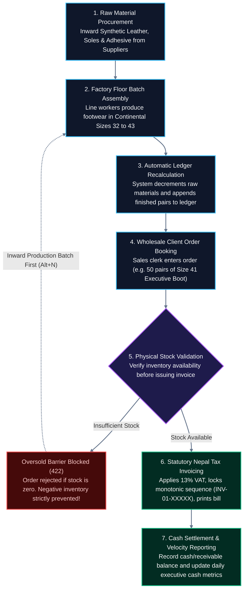
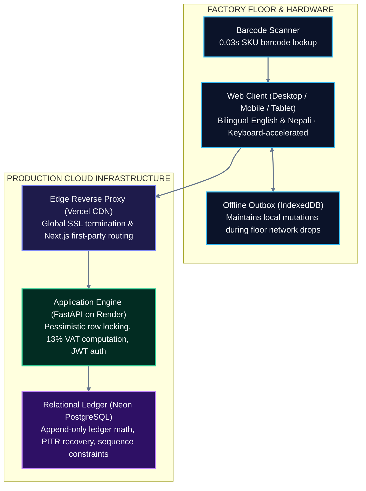

# LIVO Footwear ERP — Industrial Manufacturing Suite

[](https://livo-footwear-erp.vercel.app)
[](https://livo-footwear-erp-backend.onrender.com/docs)
[](https://neon.tech)
[](backend/tests/)
[-success?style=for-the-badge&logo=nextdotjs)](frontend/)
[](https://livo-footwear-erp.vercel.app)

> Purpose-built for **LIVO GROUP OF INDUSTRIES** footwear manufacturing operations across Nepal. Engineered for factory floor durability, zero data tampering, bilingual English/Nepali line operation, continental Paris Points sizing curves, and automated statutory tax compliance.

---

## 1. System Coordinates & Demo Access

### Production Deployments

| Resource | Environment / Target | Access / Direct Link |
| :--- | :--- | :--- |
| **Production Web Application** | Vercel Edge Global CDN | [**https://livo-footwear-erp.vercel.app**](https://livo-footwear-erp.vercel.app) |
| **Production REST Backend** | Render Container (Python 3.12 / FastAPI) | [**https://livo-footwear-erp-backend.onrender.com**](https://livo-footwear-erp-backend.onrender.com) |
| **Interactive API Documentation** | Swagger / OpenAPI 3.0 | [**Swagger UI (/docs)**](https://livo-footwear-erp-backend.onrender.com/docs) |
| **Cloud Health Probe** | Real-time DB & Container Status | [`/api/v1/health`](https://livo-footwear-erp-backend.onrender.com/api/v1/health) |

### Demonstration Credentials (1-Click Login Ready)

The live login interface includes **1-click quick-fill buttons** (`Demo Admin` / `Demo Viewer`):

| Role | Username | Password | Privileges |
| :--- | :--- | :--- | :--- |
| **Executive Admin / Editor** | `admin_demo` | `LivoAdmin2026!` | Full operational access: Batches, Inwarding, Sales, Invoicing |
| **Auditor / Floor Viewer** | `viewer_demo` | `LivoViewer2026!` | Read-only analytics: All mutation buttons strictly locked |

*Executive Pitch Script & Fast-Triage Reference:* See [`docs/CLIENT_PITCH_CHEATSHEET.md`](docs/CLIENT_PITCH_CHEATSHEET.md).

---

## 2. Factory Operational Lifecycle & Technical Architecture

### End-to-End Factory Workflow



### System Architecture



---

## 3. Core Operational Capabilities (Visual Showcase)

### 1. Bilingual Line Ergonomics (English & Nepali)
*One-tap toggle enables non-English-speaking factory personnel to operate the system smoothly.*

[](docs/demos/act1_nepali_login_keyframe.png)  
*🔍 [Click to view full widescreen desktop capture](docs/demos/act1_nepali_login_keyframe.png)*

- **What it does:** Quick 1-click persona fills (`Demo Admin` / `Demo Viewer`). The **नेपाली** button at top-right switches all navigation, buttons, and tables to authentic Nepali (*प्रयोगकर्ता, पासवर्ड, लगइन*).
- **Business value:** Eliminates operator error on the factory floor without requiring specialized computer literacy or English proficiency.
- **Direct verification:** [Open Live Login](https://livo-footwear-erp.vercel.app)

---

### 2. Daily Factory Cockpit & Velocity Tracking
*Real-time factory floor KPIs without waiting for end-of-month manual reconciliation.*

[](docs/demos/act2_executive_cockpit_keyframe.png)  
*🔍 [Click to view full widescreen desktop capture](docs/demos/act2_executive_cockpit_keyframe.png)*

- **What it does:** Consolidates daily factory throughput:
  1. **Factory Floor Velocity:** Produced pairs vs. dispatched pairs with net inventory delta.
  2. **Realized Cash Ratio:** Settled cash collected vs. outstanding receivables in NPR.
  3. **Line Efficiency:** Active line worker count and pair yield per worker.
- **Business value:** Managing directors see production bottlenecks and cash flow gaps in real time.
- **Direct verification:** [Open Live Daily Report](https://livo-footwear-erp.vercel.app)

---

### 3. Continental Footwear Sizing Matrix (Paris Points 32–43)
*Horizontal sizing distribution curves to maintain balanced carton runs.*

[](docs/demos/act3_stock_ledger_sizing_keyframe.png)  
*🔍 [Click to view full widescreen desktop capture](docs/demos/act3_stock_ledger_sizing_keyframe.png)*

- **What it does:** Renders footwear models across European sizes (**32 through 43**) on a single high-density grid. Displays real-time pair counts, wholesale unit pricing, and total stock valuation.
- **Business value:** Prevents broken size runs. Wholesale dispatchers verify whether exact sizes are in stock before committing orders to buyers.
- **Direct verification:** [Open Live Sizing Matrix](https://livo-footwear-erp.vercel.app)

---

### 4. Rapid Hands-Free Batch Entry
*Built for factory environments where operators need rapid entry without reaching for a mouse.*

[](docs/demos/act4_production_continuous_batch_keyframe.png)  
*🔍 [Click to view full widescreen desktop capture](docs/demos/act4_production_continuous_batch_keyframe.png)*

- **What it does:** Pressing <kbd>Alt+N</kbd> from any view opens the batch entry drawer. Enter pair counts and press <kbd>Ctrl+Enter</kbd> to commit. The drawer stays open in continuous rapid mode for sequential batch entry.
- **Business value:** Allows clerks to log hundreds of pairs across multiple lines in seconds with zero mouse navigation.
- **Direct verification:** Log in as Demo Admin and press <kbd>Alt+N</kbd>.

---

### 5. Wholesale Billing & Statutory 13% Nepal VAT Invoicing
*Zero arithmetic error. Computes taxes to the exact paisa and issues numbered VAT bills.*

[](docs/demos/act5_wholesale_vat_strip_keyframe.png)  
*🔍 [Click to view full widescreen desktop capture](docs/demos/act5_wholesale_vat_strip_keyframe.png)*

[](docs/demos/act5_tax_invoice_keyframe.png)  
*🔍 [Click to view full widescreen desktop capture](docs/demos/act5_tax_invoice_keyframe.png)*

- **What it does:** Select client and quantity. The system automatically computes:
  - **Taxable Subtotal:** Quantity $\times$ Unit Wholesale Rate.
  - **Statutory 13% VAT:** Computed per Nepal Inland Revenue Department (IRD) regulations.
  - **Grand Total & Receivables:** Tracks upfront cash received versus pending receivable balance.
  - **Printable Tax Invoice:** Generates standardized, numbered invoices (`INV-01-XXXXX`) with PAN blocks and signature fields.
- **Business value:** Protects the enterprise from IRD compliance penalties and eliminates calculation leakage.
- **Direct verification:** [View Sample Printable Invoice](https://livo-footwear-erp.vercel.app/api/v1/invoices/1/printable)

---

### 6. Read-Only Auditor Lockdown Mode
*Role-based security ensuring tax officers, auditors, and bank managers cannot alter data.*

[](docs/demos/act6_viewer_role_locked_keyframe.png)  
*🔍 [Click to view full widescreen desktop capture](docs/demos/act6_viewer_role_locked_keyframe.png)*

- **What it does:** Under the `viewer_demo` role, mutation controls (`+ Record Batch`, `+ Record Sale`, `Void`) are stripped from the DOM and blocked at the API layer.
- **Business value:** Allows executives to provide full inspection access to external tax auditors and lenders with complete tamper protection.
- **Direct verification:** Log out and sign in using **Demo Viewer**.

---

## 4. Architectural Guarantees & Statutory Compliance

### 1. Strict Append-Only Stock Ledger (Zero Inventory Leakage)
- Products maintain **no mutable `stock_qty` integer** in the database schema.
- Inventory is computed mathematically on-the-fly from signed ledger transactions:
  $$\text{Stock Balance} = \sum (\text{direction} \times \text{quantity}), \quad \text{direction} \in \{+1, -1\}$$
- Eliminates covert manual adjustments, undocumented edits, and internal shrinkage.

### 2. Monotonic Nepal IRD Sequential Invoicing
- Tax invoice sequence numbers (`INV-01-XXXXX`) are strictly incremented inside PostgreSQL row-level locks via the unique constraint `uq_invoice_company_sequence`.
- Prevents sequence gaps, duplicate bill numbers, and race conditions during high-volume wholesale dispatch.

### 3. Continental Footwear Sizing Curves (Paris Points 32–43)
- Models are indexed across standard continental sizing curves per colorway and SKU.
- Production and dispatch entries validate inventory availability per individual size to eliminate broken carton sets.

### 4. Factory Floor Network Fault-Tolerance
- The client-side terminal implements an **Offline Outbox** via IndexedDB.
- Mutations executed during factory floor network drops are buffered locally and synchronized to the cloud backend upon reconnect without data loss.

---

## 5. Operational Runbooks & Triage Reference

### 10-Second Operational Triage

| Symptom / Error | Root Cause | Immediate Remediation |
| :--- | :--- | :--- |
| **Spinning Page (>15s) or HTTP 504** | Cloud backend container suspended after 15 min idle | **Warm container:** Run `curl -s https://livo-footwear-erp-backend.onrender.com/api/v1/health` in any terminal; refresh page after 15 seconds. |
| **"Insufficient physical stock" (422)** | Dispatch quantity exceeds available warehouse pairs | **Inward stock first:** Open Production tab, press <kbd>Alt+N</kbd> to record finished batch (+IN), then re-submit sales order. |
| **Mutation Buttons Missing (403)** | User session scoped to read-only `viewer` role | **Switch role:** Log out and click **Demo Admin** on the login screen to regain full editing privileges. |
| **"Session expired" (401)** | JWT session token exceeded 24-hour validity | **Re-authenticate:** Click **Demo Admin** on login screen to refresh session. |
| **Factory WiFi Dropped (Offline)** | Floor internet connectivity interrupted | **Continue working:** The application saves entries locally in browser memory and auto-syncs when connectivity returns. |
| **Red Banner with `[req_xxxxxxxxxxxx]`** | Application exception during transaction | **Trace log:** Copy the support reference ID and grep server logs to identify the exact stack trace. |

### Engineering Documentation Index

| Operational Document | Scope & Purpose |
| :--- | :--- |
| [`docs/CLIENT_PITCH_CHEATSHEET.md`](docs/CLIENT_PITCH_CHEATSHEET.md) | Executive pitch scripts, pre-flight warmup procedures, and on-call demo triage. |
| [`docs/OPERATIONAL_HANDOVER.md`](docs/OPERATIONAL_HANDOVER.md) | Complete factory standard operating procedures (SOP), user roles, and backup topology. |
| [`docs/CRITICAL_DEBUGGING_RUNBOOK.md`](docs/CRITICAL_DEBUGGING_RUNBOOK.md) | Component triage guide, failure recovery protocols, and disaster recovery procedures. |
| [`docs/SYSTEM_AUDIT_REPORT.md`](docs/SYSTEM_AUDIT_REPORT.md) | Dual-persona audit covering UI/UX clarity and backend transactional integrity. |
| [`docs/RESTORE_PROCEDURE.md`](docs/RESTORE_PROCEDURE.md) | Point-in-time recovery (PITR) protocols and database failover verification tests. |
| [`docs/SECURITY_ARCHITECTURE.md`](docs/SECURITY_ARCHITECTURE.md) | JWT auth specifications, Argon2 hashing, RBAC scopes, and TLS encryption. |

---

## 6. Local Development & Verification

<details>
<summary><b>Local Development Setup (Backend & Frontend)</b></summary>

### Backend Setup (FastAPI + Python 3.12)

```bash
# Navigate to backend directory
cd backend

# Create and activate virtual environment
python -m venv venv
.\venv\Scripts\Activate.ps1   # On Windows (or 'source venv/bin/activate' on Linux/macOS)

# Install dependencies
pip install -r requirements.txt

# Run database migrations and seed demonstration data
python -m app.db.seed

# Run automated test suite (31 passing tests)
pytest

# Launch local backend server (http://localhost:8000)
uvicorn app.main:app --reload --port 8000
```

### Frontend Setup (Next.js 14 + TailwindCSS Tokens)

```bash
# Navigate to frontend directory
cd frontend

# Install dependencies
npm install

# Verify production bundle size (<115 kB budget)
npm run build

# Launch local development server (http://localhost:3000)
npm run dev
```

</details>

---

## Demonstration Team & Sign-Off

- **Client:** LIVO GROUP OF INDUSTRIES (Nepal Footwear Manufacturing)
- **Deployment Status:** Live Production (`https://livo-footwear-erp.vercel.app`)
- **Backend Architecture:** Render Cloud + Neon Serverless PostgreSQL
- **License:** Proprietary — All Rights Reserved © 2026 LIVO GROUP OF INDUSTRIES
