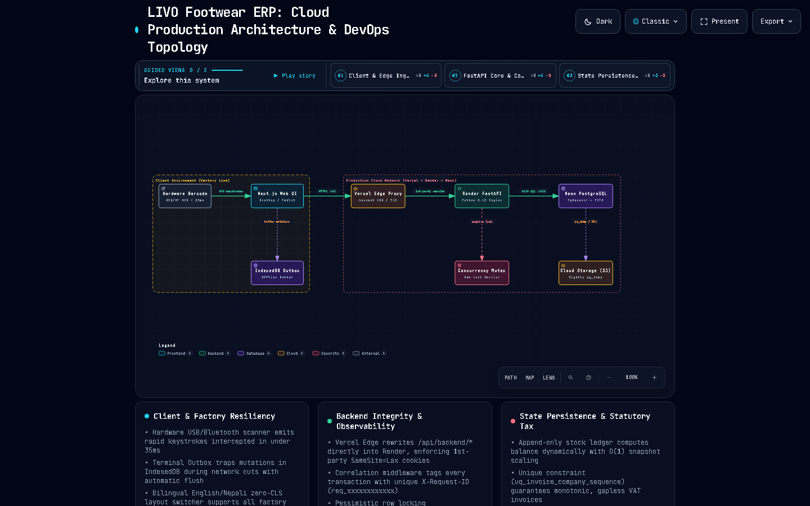
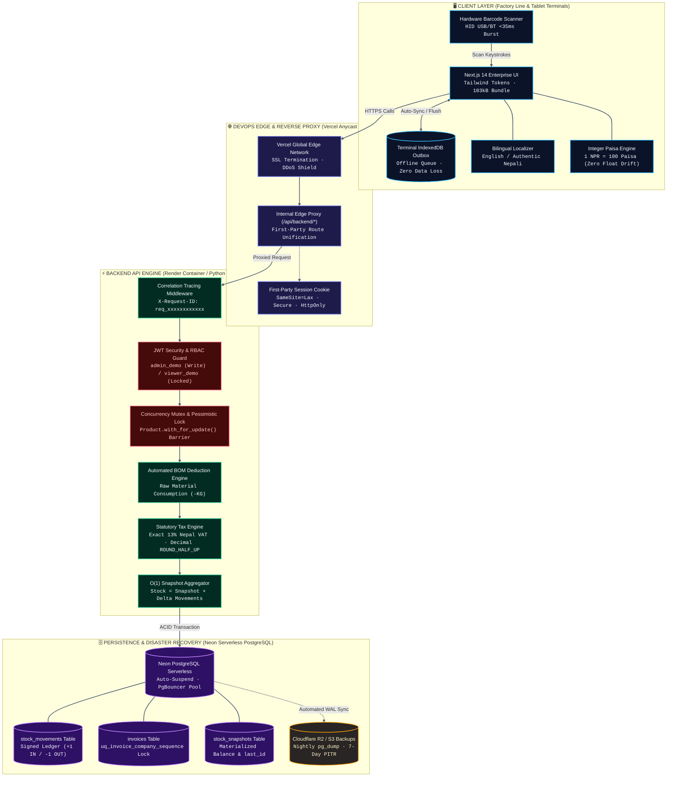
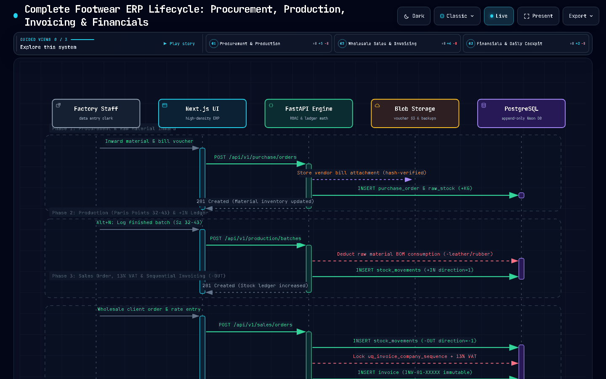
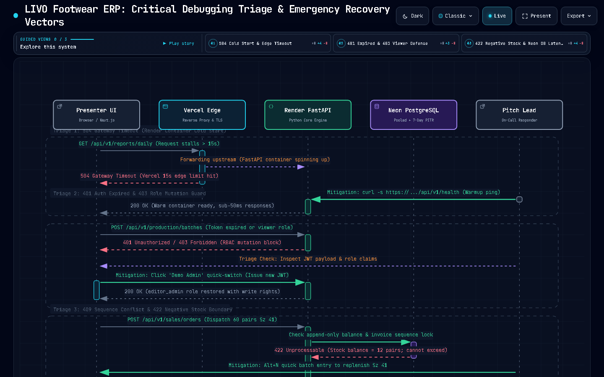
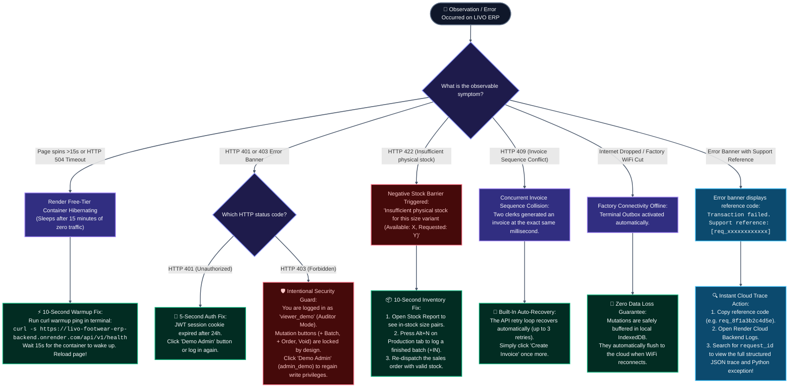

# LIVO Footwear ERP — Industrial Enterprise Manufacturing Suite

[](https://livo-footwear-erp.vercel.app)
[](https://livo-footwear-erp-backend.onrender.com/docs)
[](https://neon.tech)
[](backend/tests/)
[-success?style=for-the-badge&logo=nextdotjs)](frontend/)
[](https://livo-footwear-erp.vercel.app)

> Engineered specifically for **LIVO GROUP OF INDUSTRIES** footwear manufacturing operations across Nepal. Built for extreme factory floor durability, zero data tampering, bilingual English/Nepali line operation, continental Paris Points sizing curves, and automated statutory tax compliance.

---

## ⚡ Live Production Coordinates & Demo Credentials

| Resource | Environment / Target | Access / Direct Link |
| :--- | :--- | :--- |
| **Production Web Application** | Vercel Edge Global CDN | [**https://livo-footwear-erp.vercel.app**](https://livo-footwear-erp.vercel.app) |
| **Production REST Backend** | Render Container (Python 3.12 / FastAPI) | [**https://livo-footwear-erp-backend.onrender.com**](https://livo-footwear-erp-backend.onrender.com) |
| **Interactive API Documentation** | Swagger / OpenAPI 3.0 | [**Swagger UI (/docs)**](https://livo-footwear-erp-backend.onrender.com/docs) |
| **Cloud Health Probe** | Real-time DB & Container Status | [`/api/v1/health`](https://livo-footwear-erp-backend.onrender.com/api/v1/health) |

### Demonstration Credentials (1-Click Login Ready)

The live login interface includes **1-click quick-fill buttons** (`Demo Admin` / `Demo Viewer`):

```tsv
Role                    Username        Password          Privileges
Executive Admin/Editor  admin_demo      LivoAdmin2026!    Full operational access: Batches, Inwarding, Sales, Invoicing
Auditor / Floor Viewer  viewer_demo     LivoViewer2026!   Read-only analytics: All mutation buttons strictly locked
```

> **Client Pitch Reference:** See [**`docs/CLIENT_PITCH_CHEATSHEET.md`**](docs/CLIENT_PITCH_CHEATSHEET.md) for the 5-minute executive pitch script, pre-flight warm-up curl commands, and instant triage procedures.

---

## 🎬 Automated End-to-End Walkthrough (Acts 1–6)

Recorded live across the deployed cloud environment using the DOM/browser agent:

📹 **Full Walkthrough Video:** [**`docs/demos/livo_erp_complete_walkthrough.webm`**](docs/demos/livo_erp_complete_walkthrough.webm) *(also available as `.webp`)*

### Act 1: Login & Bilingual Factory Ergonomics
*Instant 1-click toggle between English and authentic Nepali (*प्रयोगकर्ता, पासवर्ड, लगइन*). Supports non-English-speaking factory supervisors.*


---

### Act 2: Daily Executive Cockpit & Production Velocity
*Factory Floor Velocity tracking (Produced vs. Dispatched ratio), Realized Cash Ratio, and line throughput without end-of-month lag.*


---

### Act 3: Finished Footwear Sizing Matrix (Paris Points 32–43)
*Continental sizing curves across standard footwear sizes (32–43) with green in-stock indicators, zero-stock dashes, sticky columns, and 1-click CSV export.*


---

### Act 4: Hands-Free Rapid Production Entry
*Keyboard-driven sequential entry (<kbd>Alt+N</kbd> drawer trigger, sequential field traversal, <kbd>Ctrl+Enter</kbd> commit) with auto-incrementing batch sequence (`BATCH-1680`).*


---

### Act 5: Wholesale Sales Order, Live 13% VAT Strip & Sequential Invoice
*Live calculation of taxable subtotal, 13% Nepal VAT, and gross NPR. Issues gapless, monotonic tax invoices (`INV-01-XXXXX`) with PAN and signature blocks.*


---

### Act 6: Role-Based Security Smoke Check (Viewer Lockout)
*Demonstrating read-only auditor mode: Mutation actions (`+ Record Batch`, `+ Record Sale`, `Void`) are completely removed from the interface and guarded at the API level.*


---

## 📐 Enterprise Architecture, Lifecycles & Rookie Debugging Playbook

### 1. Cloud Production Architecture & DevOps Topology

> **Full-Stack Blueprint:** Follows requests from hardware barcode scanners through Vercel edge reverse proxying, Render containerized FastAPI with in-process concurrency mutexes, to Neon serverless PostgreSQL with 7-day point-in-time recovery.



<details>
<summary><b>🔍 View Interactive Topology Code & Subsystem Map (Click to Expand)</b></summary>



</details>

---

### 2. End-to-End Manufacturing & Financial Lifecycle Workflow

> **Factory Operations Lifeline:** Tracks raw material inwarding, automated BOM deductions, finished Paris Points batch creation, wholesale orders, monotonic VAT invoicing, and daily executive rollups.

```mermaid
flowchart LR
    classDef step fill:#0f172a,stroke:#3b82f6,stroke-width:2px,color:#f8fafc;
    classDef action fill:#022c22,stroke:#10b981,stroke-width:2px,color:#f8fafc;
    classDef check fill:#2e1065,stroke:#a855f7,stroke-width:2px,color:#f8fafc;
    classDef reject fill:#450a0a,stroke:#ef4444,stroke-width:2px,color:#fecaca;
    classDef finish fill:#1e1b4b,stroke:#06b6d4,stroke-width:2px,color:#f8fafc;

    subgraph S1 ["Phase 1: Procurement"]
        PO["Raw Material Purchase Order<br/>(Synthetic Leather, Soles, Glue)"]:::step
        RM_LEDGER["Raw Material Ledger<br/>(+KG / +Meters Inward)"]:::action
    end

    subgraph S2 ["Phase 2: Manufacturing"]
        BATCH["Log Production Batch<br/>(Paris Points 32–43 Sizing)"]:::step
        BOM["Auto BOM Engine<br/>(-Raw Material Consumed)"]:::action
        IN_LEDGER["Stock Movement (+IN)<br/>(+Pairs Finished Footwear)"]:::action
    end

    subgraph S3 ["Phase 3: Wholesale Dispatch"]
        SO["Wholesale Sales Order<br/>(Client &amp; SKU Selection)"]:::step
        LOCK_CHECK{"Pessimistic Lock Check<br/>(Stock &gt;= Quantity?)"}:::check
        OUT_LEDGER["Stock Movement (-OUT)<br/>(-Pairs Dispatched)"]:::action
        ERR_422["HTTP 422 Barrier<br/>(Oversell Prevented)"]:::reject
    end

    subgraph S4 ["Phase 4: Statutory Invoicing"]
        VAT_CALC["Paisa Precision Calc<br/>(Subtotal + 13% Statutory VAT)"]:::step
        INV_LOCK["Monotonic Sequence Lock<br/>(INV-01-XXXXX DB Constraint)"]:::action
        PRINT_INV["Statutory Printable Invoice<br/>(PAN, Signatures, Line Items)"]:::finish
    end

    subgraph S5 ["Phase 5: Financial Velocity"]
        PAYMENT["Record Payment<br/>(Cash / Bank Transfer)"]:::step
        COCKPIT["Executive Cockpit<br/>(Realized Cash &amp; Factory Velocity)"]:::finish
    end

    PO --> RM_LEDGER
    RM_LEDGER --> BOM
    BATCH --> BOM
    BOM --> IN_LEDGER
    IN_LEDGER --> SO
    SO --> LOCK_CHECK
    LOCK_CHECK -->|"Stock Verified"| OUT_LEDGER
    LOCK_CHECK -->|"Deficit Detected"| ERR_422
    OUT_LEDGER --> VAT_CALC
    VAT_CALC --> INV_LOCK
    INV_LOCK --> PRINT_INV
    PRINT_INV --> PAYMENT
    PAYMENT --> COCKPIT

    linkStyle default stroke:#64748b,stroke-width:2px;
```



<details>
<summary><b>🔍 View Sequential Pipeline Chart (Click to Expand)</b></summary>



</details>

---

### 3. Critical Debugging Triage Flowchart & Emergency Lifelines

> **On-Call Pitch & Production Diagnostic Matrix:** Maps edge timeouts, JWT expiration, viewer role lockouts, sequence collisions, and negative stock barriers directly to 10-second solutions.



---

### 🩺 Rookie-Proof Troubleshooting Decision Tree

Follow this exact diagnostic tree whenever diagnosing an error or unexpected state:



---

### 🚨 Emergency Triage Matrix & Quick Commands

| Error / State | Root Cause | Immediate 10-Second Remediation |
| :--- | :--- | :--- |
| <kbd>HTTP 504</kbd> **Cold Start** | Render free-tier container suspended after 15 min idle | Run: `curl -s https://livo-footwear-erp-backend.onrender.com/api/v1/health` (Warms container in 15s). |
| <kbd>HTTP 401</kbd> **Session Expired** | JWT session token expired after 24h session window | Click **Demo Admin** on the login screen to re-authenticate with full credentials. |
| <kbd>HTTP 403</kbd> **Viewer Lockout** | User session is scoped to read-only `viewer` role | Switch persona to `editor` or click **Demo Admin** (`admin_demo`) to perform mutations. |
| <kbd>HTTP 422</kbd> **Stock Barrier** | Pessimistic stock boundary: Requested quantity > Available pairs | Open **Stock Report**, check size inventory, and log a production batch (+IN) before dispatch. |
| <kbd>HTTP 409</kbd> **Sequence Conflict** | Monotonic invoice sequence collision under simultaneous billing | The API retries 3 times automatically. If retries exhaust, click **Create Invoice** once more. |
| <kbd>OFFLINE</kbd> **Network Dropped** | Factory floor WiFi or cellular backup dropped | Do not reload: The **Terminal Outbox** buffers mutations and will auto-flush upon reconnect. |
| <kbd>TRACE</kbd> **Unknown Exception** | Backend application exception during transaction | Copy support reference `[req_xxxxxxxxxxxx]` from the UI and grep Render cloud logs. |

---

## 🏛️ Core Architectural Pillars

### 1. Strict Append-Only Stock Ledger (Zero Inventory Theft)
- Products have **no mutable `stock_qty` integer** in the database.
- Inventory is computed mathematically on-the-fly from the signed, append-only `stock_movements` ledger:
  $$\text{Stock Balance} = \sum (\text{direction} \times \text{quantity}), \quad \text{direction} \in \{+1, -1\}$$
- Prevents stealth adjustments, unauthorized manual edits, and inventory leakage.

### 2. Monotonic Nepal IRD Sequential Invoicing
- Tax invoice numbers follow the format `INV-01-XXXXX` and are strictly locked at the PostgreSQL transaction level via the unique constraint `uq_invoice_company_sequence`.
- Prevents sequence gaps, duplicate numbers, and concurrency race conditions during wholesale billing surges.

### 3. Continental Footwear Sizing Curves (Paris Points 32–43)
- Models are indexed across standard continental sizing (32 to 43) per colorway and SKU.
- Production and dispatch entries validate inventory availability per individual size to eliminate broken size runs and unmatched cartons.

### 4. Bilingual Factory Floor Accessibility (a11y)
- Zero-dependency client-side localization provider supporting full English and authentic Nepali (*दैनिक प्रतिवेदन, स्टक लेजर, उत्पादन ब्याच, बिक्री तथा बिलिङ*).
- Persistent language state in `localStorage` with zero layout shift (CLS < 0.02).
- Keyboard shortcuts (<kbd>Alt+N</kbd>, <kbd>Ctrl+Enter</kbd>, <kbd>Esc</kbd>) allow floor clerks to record production continuous batches mouse-free.

---

## 📚 Complete Engineering Documentation & Playbooks

| Document | Purpose |
| :--- | :--- |
| [**`docs/CLIENT_PITCH_CHEATSHEET.md`**](docs/CLIENT_PITCH_CHEATSHEET.md) | Executive demonstration reference, 5-minute presentation script, and on-call pitch triage matrix. |
| [**`docs/OPERATIONAL_HANDOVER.md`**](docs/OPERATIONAL_HANDOVER.md) | Complete factory standard operating procedure (SOP), role-based permissions matrix, and backup topologies. |
| [**`docs/CRITICAL_DEBUGGING_RUNBOOK.md`**](docs/CRITICAL_DEBUGGING_RUNBOOK.md) | 5-second component triage guide, error code matrix, and emergency disaster recovery playbooks. |
| [**`docs/SYSTEM_AUDIT_REPORT.md`**](docs/SYSTEM_AUDIT_REPORT.md) | Dual-persona adversarial audit covering UI/UX ergonomic clarity and backend architectural integrity. |
| [**`docs/RESTORE_PROCEDURE.md`**](docs/RESTORE_PROCEDURE.md) | Point-in-time recovery (PITR) procedures, database failover protocols, and verification tests. |
| [**`docs/SECURITY_ARCHITECTURE.md`**](docs/SECURITY_ARCHITECTURE.md) | JWT auth flow, Argon2 password hashing, RBAC scopes, and TLS encryption specifications. |

---

## 🛠️ Local Development & Quick Start

### Backend (FastAPI + Python 3.12)

```bash
# Navigate to backend directory
cd backend

# Create virtual environment
python -m venv venv
.\venv\Scripts\Activate.ps1   # On Windows (or source venv/bin/activate on Linux/macOS)

# Install dependencies
pip install -r requirements.txt

# Run database migrations & seed test fixtures
python -m app.db.seed

# Run automated test suite (27 passing tests)
pytest

# Launch local API engine (http://localhost:8000)
uvicorn app.main:app --reload --port 8000
```

### Frontend (Next.js 14 + TailwindCSS Tokens)

```bash
# Navigate to frontend directory
cd frontend

# Install dependencies
npm install

# Verify production bundle size (<110 kB constraint)
npm run build

# Launch development server (http://localhost:3000)
npm run dev
```

---

## 👥 Demonstration Team & Sign-Off

- **Client:** LIVO GROUP OF INDUSTRIES (Nepal Footwear Manufacturing)
- **Deployment Status:** Live Production (`https://livo-footwear-erp.vercel.app`)
- **Backend Architecture:** Render Cloud + Neon Serverless PostgreSQL
- **License:** Proprietary — All Rights Reserved © 2026 LIVO GROUP OF INDUSTRIES
