# LIVO FOOTWEAR ERP — FACTORY OPERATIONS MANUAL & CLIENT IMPLEMENTATION PLAYBOOK

**Standard Operating Procedures (SOP), Shop-Floor Workflows & Nepal Statutory Compliance Guide**  
*Document Reference: LIVO-SOP-2026-V2.4 • Effective: September 2026*  
*Facility: Livo Footwear Industries Pvt. Ltd. (Kathmandu & Biratnagar Plants) • IRD PAN: 609823412*  

> **Official PDF Manual Available:**  
> A high-resolution, print-ready PDF version of this manual with embedded DOM callout badges is located at:  
> [LIVO_ERP_Visual_Operations_Manual_and_Playbook.pdf](file:///d:/Antigravity/Footwear%20app/docs/LIVO_ERP_Visual_Operations_Manual_and_Playbook.pdf)

---

## Executive Summary & System Profile

LIVO Footwear ERP is an industrial manufacturing and inventory execution system custom-engineered for footwear manufacturing plants in Nepal. It combines double-entry subledger integrity, Continental Paris Points sizing matrix analytics (sizes 32–43), and strict statutory compliance with the Inland Revenue Department (IRD) of Nepal (Schedule-5 Tax Invoices under 13% VAT).

- **Production URL:** `https://livo-footwear-erp.vercel.app`
- **Backend API:** `https://livo-footwear-erp-backend.onrender.com`
- **Theme Identity:** "Industrial Paper" (Matte `#F8FAFC` slate canvas, high-contrast `#0F172A` text, 1px `#CBD5E1` borders, zero glare under fluorescent plant lights).

---

## Table of Contents

1. [Chapter 1: Getting Started & Computer Setup](#chapter-1-getting-started--computer-setup)
2. [Chapter 2: The Factory Screen Layout](#chapter-2-the-factory-screen-layout)
3. [Chapter 3: Production Batch Entry (Ramesh's "No-Mouse" Workflow)](#chapter-3-production-batch-entry-उत्पादन-दाखिला)
4. [Chapter 4: Stock Ledger & Sizing Matrix (Sita's Rack Audit Workflow)](#chapter-4-stock-ledger--sizing-matrix-मौज्दात-खाता)
5. [Chapter 5: Controlled Stock Corrections (Damage, Recount & Samples)](#chapter-5-controlled-stock-corrections-स्टक-मिलान)
6. [Chapter 6: Wholesale Dispatch & Nepal Tax Invoices (Carton Math & Schedule-5)](#chapter-6-wholesale-dispatch--nepal-tax-invoices-कर-बिजक)
7. [Chapter 7: Party Accounts & Customer Aging (Managing Credit Limits & Cash Receipts)](#chapter-7-party-accounts--customer-aging-पार्टी-बाँकी)
8. [Chapter 8: Auditor Read-Only Mode (Hari Prasad's Verification Workflow)](#chapter-8-auditor-read-only-mode-निरीक्षण-मोड)
9. [Chapter 9: 10-Second Quick Troubleshooting Guide](#chapter-9-10-second-quick-troubleshooting-guide)
10. [Appendix: Critical Safety & Resilience Demonstrations](#appendix-critical-safety--resilience-demonstrations)

---

## Factory Personas: "A Day on the Factory Floor"

### 1. Ramesh — Shop-Floor Data Entry Clerk (Line 1 & 2 Assembly)
- **Environment:** Noisy, brightly lit assembly plant near conveyor belts. Works standing up or on a high stool.
- **Habits:** Fast typist on numeric keypad; avoids the mouse because it slows down batch entry.
- **Daily Task:** Enter 400–800 finished pairs per shift across Continental sizes 32–43 using only <kbd>Tab</kbd>, <kbd>Enter</kbd>, and <kbd>Ctrl+Enter</kbd>.

### 2. Sita — Warehouse Storekeeper & Wholesale Dispatcher
- **Environment:** Finished goods warehouse, loading docks, delivery trucks.
- **Habits:** Meticulous, counts cartons on trucks, verifies carton-to-pair ratios (`1 Carton = 12 Pairs`), checks buyer PAN numbers.
- **Daily Task:** Issue official Nepal IRD Schedule-5 Tax Invoices, verify physical rack counts, spot broken size curves.

### 3. Hari Prasad — Statutory Auditor & Tax Consultant
- **Environment:** Accounts and internal audit office.
- **Habits:** Skeptical, looks for ledger gaps, double-checks arithmetic down to the exact paisa.
- **Daily Task:** Log in via `viewer_demo` to audit stock cards, inspect overdue aging buckets (61–90d, >90d), and export CSV reconciliation reports.

---

## Chapter 1: Getting Started & Computer Setup

### 1.1 Terminal & Hardware Setup
- **Screen Resolution:** 1920×1080 desktop monitors or 1280×800 shop-floor tablets.
- **Recommended Browser:** Google Chrome 110+ or Microsoft Edge.
- **Desktop Shortcut:**
  1. Open Chrome and go to `https://livo-footwear-erp.vercel.app`
  2. Click Menu (**⋮**) &rarr; **Save and share** &rarr; **Create Shortcut...**
  3. Check *"Open as window"* and click **Create**. This launches the ERP as a native application without browser URL bars.

### 1.2 Screen 01: Authentication Gateway (`/login`)
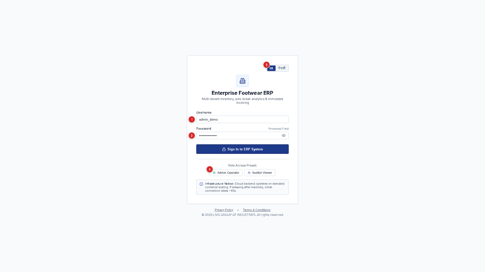

| Callout | Element | Purpose | Operator Action |
|:---:|:---|:---|:---|
| `[1]` | **Username** | Operator account identity (`admin_demo` or `viewer_demo`). | Type username. |
| `[2]` | **Password** | Encrypted authentication token. | Type password. |
| `[3]` | **Show/Hide** | Reveals password characters to prevent typos in plant. | Click Eye icon. |
| `[4]` | **Language Toggle** | Persistent toggle: English vs. Nepali factory vernacular. | Click `EN` or `नेपाली`. |
| `[5]` | **Demo Personas** | Fast 1-click credential fill for drills and training. | Click `Admin Operator`. |

> **Bilingual Rule:** When **EN** is selected, all labels, table headers, and badges are in pure English with zero Nepali script. When **नेपाली** is selected, labels use authentic factory vernacular (e.g., `उत्पादन दाखिला (Production Entry)`).

---

## Chapter 2: The Factory Screen Layout

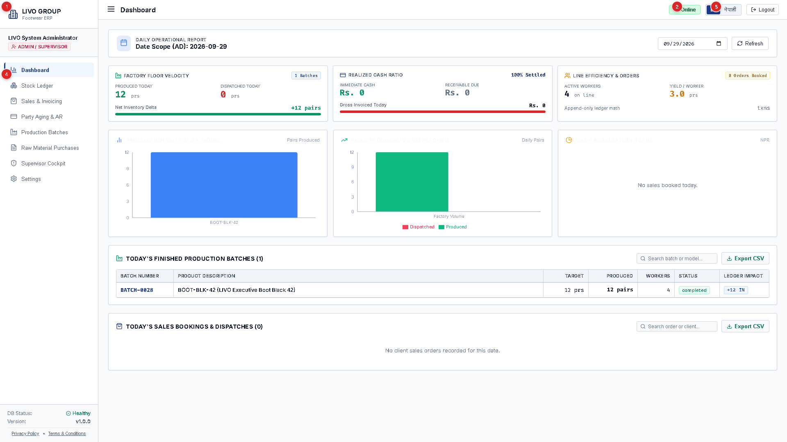

| Callout | Element | What It Tells the Worker | Action |
|:---:|:---|:---|:---|
| `[1]` | **Top Banner** | Factory legal entity and IRD PAN (`609823412`). | Return to dashboard. |
| `[2]` | **Network Status** | 🟩 **Online:** Connected to server. 🟧 **Offline:** Saving to local IndexedDB. 🟦 **Syncing:** Sending offline queue to server. | Hover to view queue count. |
| `[3]` | **Active Role** | Shows user privileges (`admin` vs. `viewer`). | Security boundary status. |
| `[4]` | **Module Tabs** | Navigation between the 6 operational departments. | Click to switch view instantly. |
| `[5]` | **Language Switch** | Persistent top-right language toggle. | Remembers user choice. |

---

## Chapter 3: Production Batch Entry (उत्पादन दाखिला)

| Callout | Element | Factory Purpose | Shortcut |
|:---:|:---|:---|:---|
| `[1]` | **Shoe Model** | Selects target shoe article (e.g., `LIVO Urban Runner`). | <kbd>Alt+M</kbd> |
| `[2]` | **Line & Shift** | Tags batch to conveyor line (1/2) and shift team (1/2/3). | <kbd>Tab</kbd> |
| `[3]` | **Paris Points (32–43)** | 12 Continental footwear sizing inputs. | <kbd>Tab</kbd> / <kbd>Enter</kbd> |
| `[4]` | **Live Review Strip** | Real-time tally of pairs and target plan variance. | Real-time calc |
| `[5]` | **Commit & Save** | Saves batch, generates voucher, and resets cursor to Size 32. | <kbd>Ctrl+Enter</kbd> |

### The "No-Mouse" Rapid Entry Drill (Ramesh's Method)
1. Select Model and Line with arrow keys.
2. Press <kbd>Tab</kbd> until cursor enters **Size 32**.
3. Type pair quantity on numeric pad (e.g., `12`), press <kbd>Enter</kbd> &rarr; cursor jumps to **Size 33**.
4. Repeat across sizes 34 through 43.
5. Press <kbd>Ctrl+Enter</kbd> to save. The screen confirms *"Batch saved successfully!"*, clears the inputs, and places cursor back into Size 32.

---

## Chapter 4: Stock Ledger & Sizing Matrix (मौज्दात खाता)

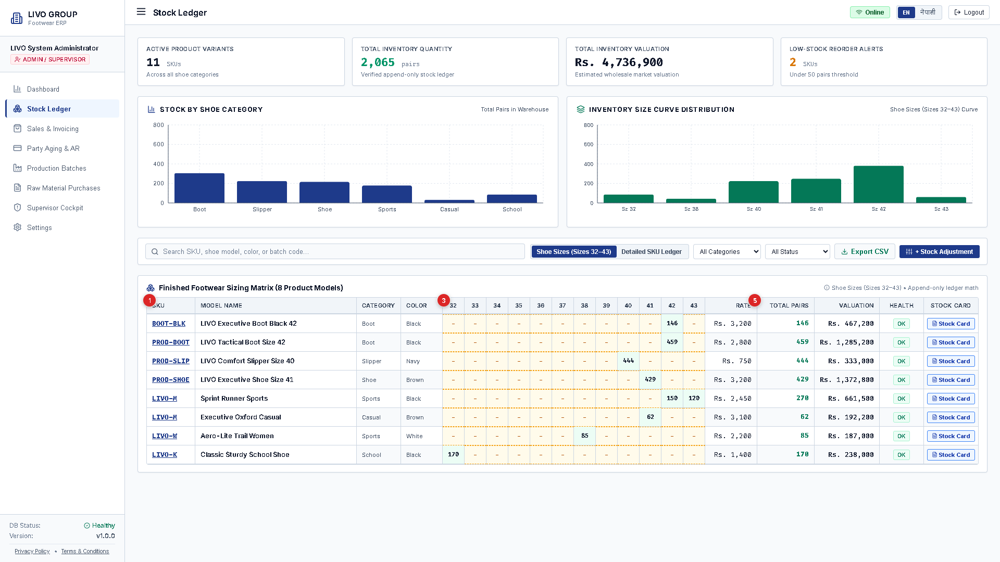

| Callout | Column | Factory Meaning | Action Required |
|:---:|:---|:---|:---|
| `[1]` | **Pinned SKU** | Permanent article code. Stays locked on left while scrolling. | Search by code. |
| `[2]` | **Pinned Name** | Commercial model name and colorway. | Click to open Stock Card. |
| `[3]` | **Size Grid (32–43)** | **Bold:** Available pairs. **Dash (—):** Not manufactured. **Red 0!:** Stockout. | Audit physical shelf racks. |
| `[4]` | **Broken Run Badge** | Red alert: `[! 39-41 Broken]` core sizes missing. | Restrict wholesale orders. |
| `[5]` | **Total Pairs** | Total physical inventory across all sizes for this SKU. | Verify against ledger. |

### The Stock Card Modal (स्टक कार्ड)
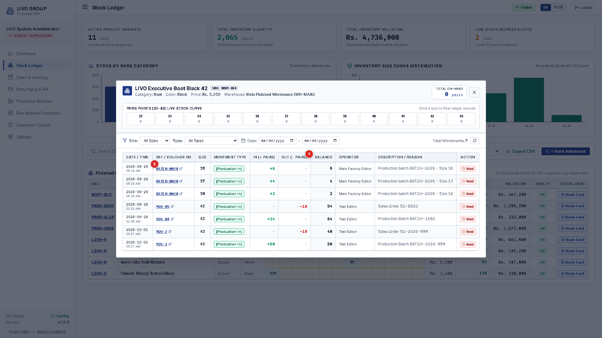

- `[1]` **Live Size Curve Dock:** Real-time shelf inventory across all 12 sizes.
- `[2]` **Inflow (+):** Finished goods added from assembly line batches.
- `[3]` **Outflow (-):** Pairs deducted for wholesale invoices or samples.
- `[4]` **Running Balance:** Continuous cumulative balance with zero-floor safeguard.
- `[5]` **Voucher Reference:** Clickable audit trail linking to `BATCH-XXXX` or `INV-01-XXXX`.

---

## Chapter 5: Controlled Stock Corrections (स्टक मिलान)

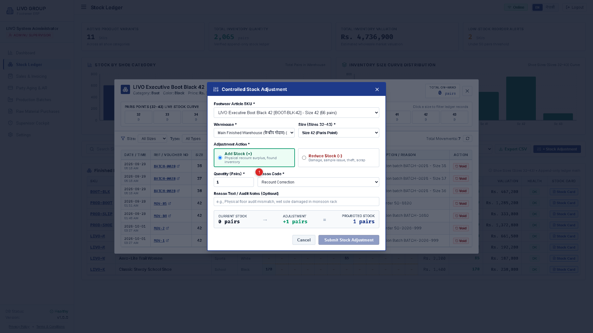

Normal staff cannot simply edit or overwrite inventory numbers. Any physical count discrepancy requires a controlled adjustment entry:

1. `[1]` **Reason Code:** Select official reason (`RECOUNT`, `DAMAGED`, `SAMPLE`, `SCRAP`).
2. `[2]` **Reason Explanations:**
   - *Recount:* Warehouse cycle count adjustment.
   - *Damaged:* Torn leather, defective sole bonding.
   - *Sample:* Pair taken for showroom display.
   - *Scrap:* Beyond salvage; sent to recycling.
3. `[3]` **Target Size:** Choose specific Paris point (e.g., Size 41).
4. `[4]` **Supervisor Token:** When reducing stock, a supervisor token/PIN is required.
5. `[5]` **Commit Adjustment:** Generates an `ADJ-XXXX` voucher.

---

## Chapter 6: Wholesale Dispatch & Nepal Tax Invoices (कर बिजक)

- `[1]` **Buyer Name:** Registered wholesale dealer or dealer outlet.
- `[2]` **Buyer PAN:** Mandatory 9-digit tax number for commercial credit invoices.
- `[3]` **Carton Packaging Helper:** `1 Carton = 12 Pairs`. Typing 20 cartons auto-fills 240 pairs.
- `[4]` **13% Nepal VAT:** Calculated in exact integer paisa arithmetic.
- `[5]` **Grand Total (NPR):** Total receivable amount including tax.

### Official Nepal IRD Schedule-5 Tax Invoice Printout
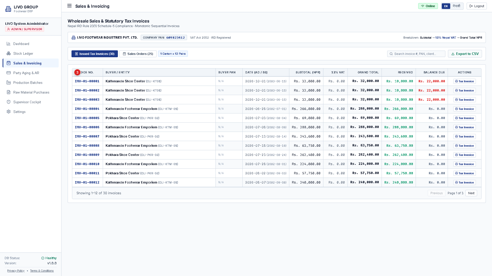

- `[1]` **Seller Details & PAN:** LIVO GROUP OF INDUSTRIES PVT. LTD., PAN: `609823412`.
- `[2]` **Buyer Details & PAN:** Customer name, shipping address, and registered PAN.
- `[3]` **Itemized Particulars:** Clean table with article, size, carton count, pairs, rate, and amount.
- `[4]` **Taxable Subtotal:** Net taxable amount, 13% VAT, and Grand Total.
- `[5]` **Dual Signatures:** Receiver Signature (left) and Store In-charge Signature (right).

---

## Chapter 7: Party Accounts & Customer Aging (पार्टी बाँकी)

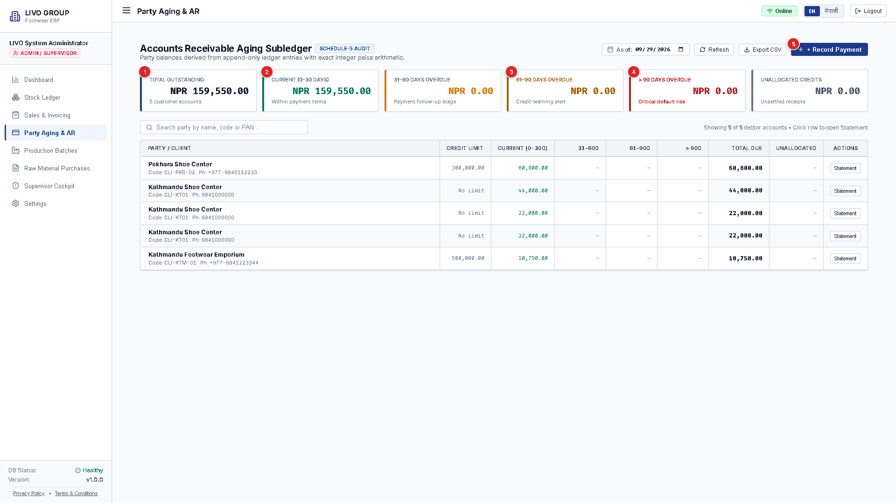

- `[1]` **Total Outstanding:** Total money owed across all wholesale accounts.
- `[2]` **Current (0–30 Days):** Deliveries within normal 30-day payment terms.
- `[3]` **61–90 Days (Warning):** Past due; follow-up calls required.
- `[4]` **>90 Days (Default Risk):** Severe default risk; automatic dispatch freeze.
- `[5]` **+ Record Payment:** Logs bank deposit voucher or cash receipt.

### Party Account Statement & Dispute Ledger
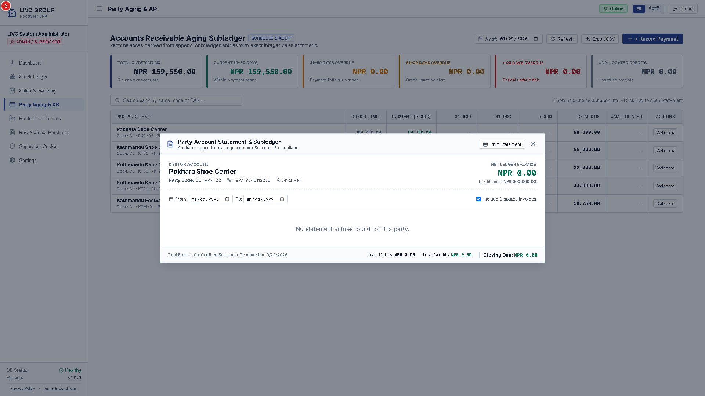

- `[1]` Debtor Account info & PAN.
- `[2]` Net Ledger Balance in NPR.
- `[3]` Debit (+) column: Invoices issued.
- `[4]` Credit (-) column: Payments received.
- `[5]` Running balance after each transaction.
- `[6]` Audit/Dispute toggle: Flags disputed invoices for investigation without altering tax liability.

---

## Chapter 8: Auditor Read-Only Mode (निरीक्षण मोड)

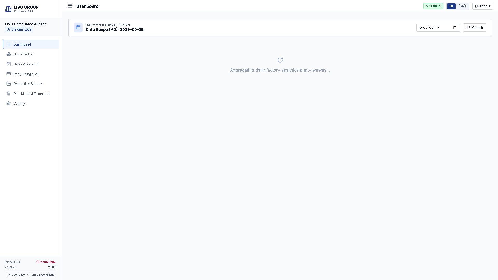

When logging in as `viewer_demo`:
1. `[1]` **Viewer Role Indicator:** Header confirms read-only audit status.
2. `[2]` **Export CSV Available:** Raw data tables can be exported to Excel/CSV for statutory tax filing.
3. `[3]` **Absence of Mutation Buttons:** All buttons (`+ New Batch`, `+ Stock Adjustment`, `+ Record Payment`) vanish from the interface. Shortcuts like <kbd>Ctrl+Enter</kbd> are disabled.

---

## Chapter 9: 10-Second Quick Troubleshooting Guide

| Problem | Root Cause | Immediate Solution |
|:---|:---|:---|
| **"504 Gateway Timeout" or slow initial load** | Free backend server on Render goes to sleep after inactivity. | Wait 30 seconds for the backend to wake up, then press <kbd>Ctrl+F5</kbd>. |
| **"Insufficient stock in Size 41" on invoice** | Zero-Floor Protection: Selling more pairs than exist on warehouse racks. | Check Stock Card. Verify physical pairs on shelf. Ensure production batch was entered. |
| **Customer has red [HOLD] badge** | Credit Limit Lockdown: Unpaid balance exceeds approved ceiling. | Collect bank payment. Once accountant records receipt, hold clears automatically. |
| **Orange Status Badge: "अफलाइन (Offline)"** | Factory Wi-Fi or router connection dropped. | Continue working! Batches save to browser IndexedDB and sync automatically when internet returns. |
| **Printer cuts off right invoice margin** | Browser print margins misconfigured. | In Chrome print dialog, set Paper Size to `A4`, Margins to `Default`, and check `Background Graphics`. |

---

## Appendix: Critical Safety & Resilience Demonstrations

### Sequence A: Rapid Keyboard Batch Entry
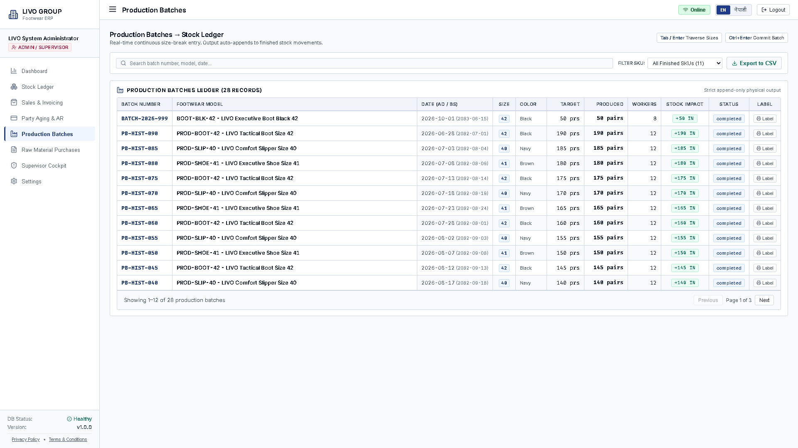

### Sequence B: Zero-Floor Stockout Protection
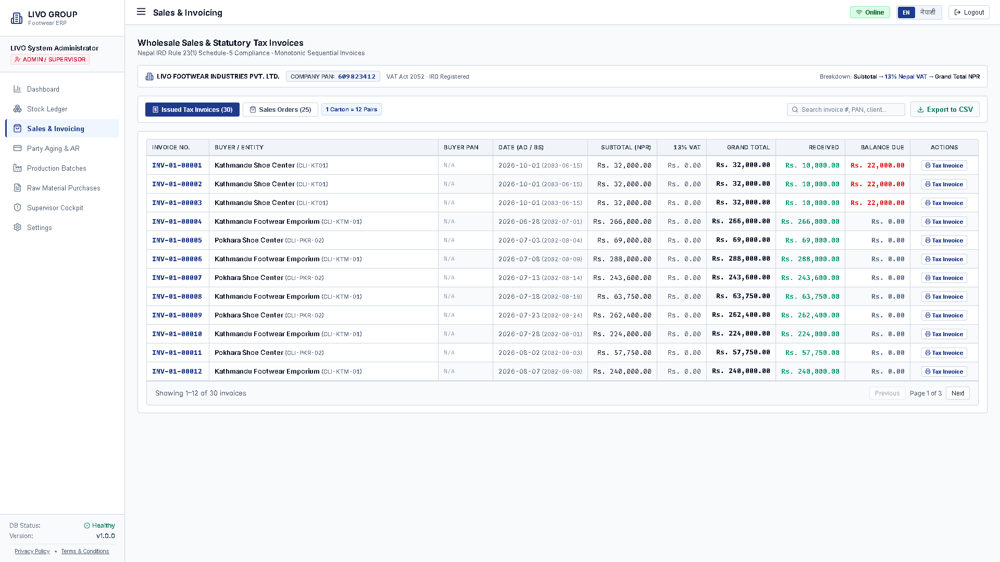
*Attempting to dispatch 9,999 pairs when only 2 exist: System blocks submission with plain-language explanation.*

### Sequence C: Credit Limit Lockdown
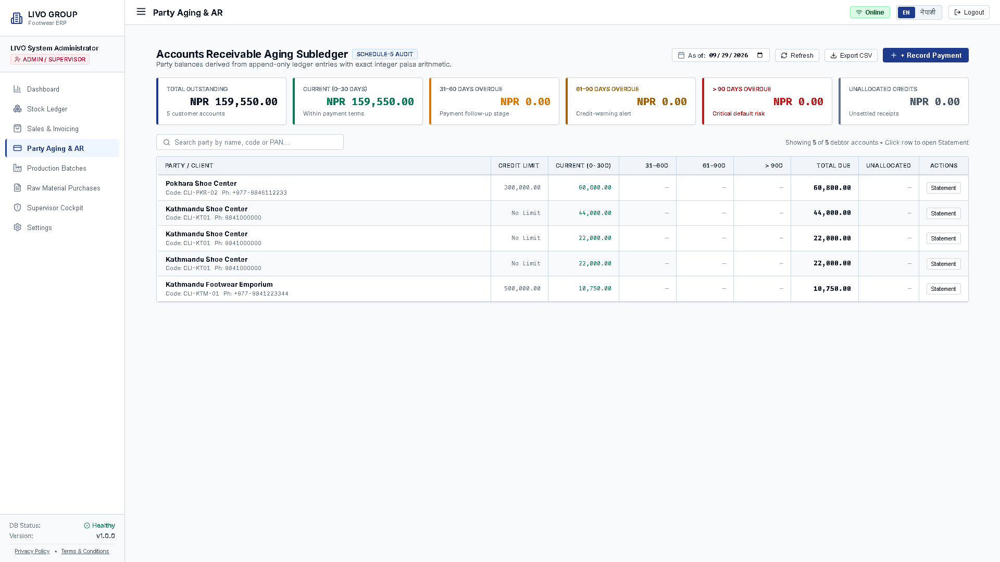
*Customer exceeding credit ceiling receives a red [HOLD] badge and dispatch is prevented.*

---
*LIVO Footwear ERP • Standard Operating Procedure & Client Implementation Playbook*  
*Quality & Systems Engineering Division • Livo Group of Industries Pvt. Ltd.*
